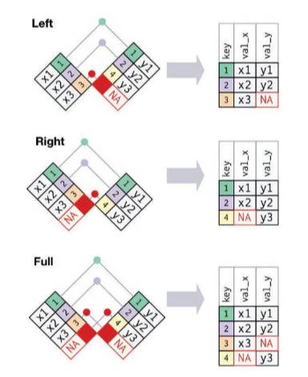
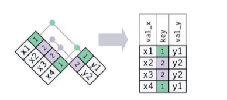
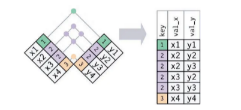
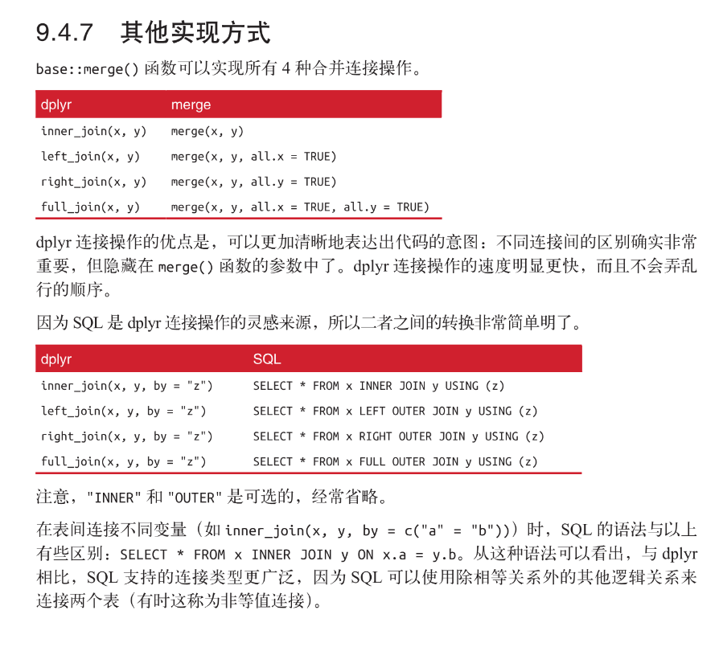

# 使用命令跟新R版本

在R控制台中输入以下命令：

```R
install.packages('installr')
library(installr)
updateR()
```

## dplyr

### 进行数据转换

#### filter()筛选行

#### arrange()排列行

#### select()选择列

#### mutate()添加新变量

#### summarize()分组摘要

### 处理关系数据

#### 键

主键：唯一标识其所在数据表中的观测。

外键：唯一标识另一个数据表中的观测。

一个变量既可以是主键，也可以是外键。

一旦识别出表的主键，最好验证一下，看看它们能否真正唯一标识每个观测。一种验证方法是对主键进行 count() 操作，然后查看是否有 n 大于 1 的记录：

```R
planes %>% 
  count(tailnum) %>% 
  filter(n > 1)

weather %>% 
  count(year, month, day, hour, origin) %>% 
  filter(n > 1)
```

如果一张表没有主键，有时就需要使用 mutate() 函数和 row_number() 函数为表加上一个主键。这样一来，如果你完成了一些筛选工作，并想要使用原始数据检查的话，就可以更容易地匹配观测。这种主键称为代理键。

#### 合并连接

合并连接可以将两个表格中的变量组合起来，它先通过两个表格的键匹配观测，然后将一个表格中的变量复制到另一个表格中。

```R
flights2 <-  flights %>% 
  select(year:day, hour, origin, dest, tailnum, carrier)

flights2 %>% 
  select(-origin, -dest) %>% 
  left_join(airlines, by="carrier")
```

实际上上面这个案例可以通过mutate()函数和R的取子集达到同样的效果：

```R
flights2 %>% select(-origin, -dest) %>% 
  mutate(name=airlines$name[match(carrier,airlines$carrier)])
```

但是这种方式很难推广到需要匹配多个变量的情况。

案例数据集

```R
x <- tribble(
  ~key, ~val_x,
  1, "x1",
  2, "x2",
  3, "x3"
)
y <- tribble(
  ~key, ~val_y,
  1, "y1",
  2, "y2",
  4, "y3"
)
		
```

##### 内连接

内连接的结果是一个新数据框，其中包含键、x 值和 y 值。使用 by 参数告诉 dplyr 哪个变量是键：


```R
x %>% 
  inner_join(y, by="key")
```

内连接最重要的性质是，没有匹配的行不会包含在结果中。外连接有3中类型：

- 左连接：保留 x 中的所有观测。
- 右连接：保留 y 中的所有观测
- 全连接：保留 x 和 y 中的所有观测。



外连接则保留至少存在于一个表中的观测。

##### 重复键

- 一张表中具有重复键。通常来说，当存在一对多关系时。



- 两张表中都有重复键。这通常意味着出现了错误，因为键在任意一张表中都不能唯一标识观测。当连接这样的重复键时，你会得到所有可能的组合，即笛卡儿积：
- 

##### 定义键列

可以对 by 设置其他值，以另外的方式来连接表。

- 默认值by = NULL

    这会使用存在于两个表中的所有公共变量，这种方式称为自然连接。

- 字符向量 by = "x"。

​	这种方式与自然连接很相似，但只使用某些公共变量。

- 命名字符向量 by = c("a" = "b")。

    这种方式会匹配 x 表中的 a 变量和 y 表中的 b 变量。输出结果中使用的是 x 表中的变量。

##### 其他实现方式



#### 筛选连接

#### 集合操作


