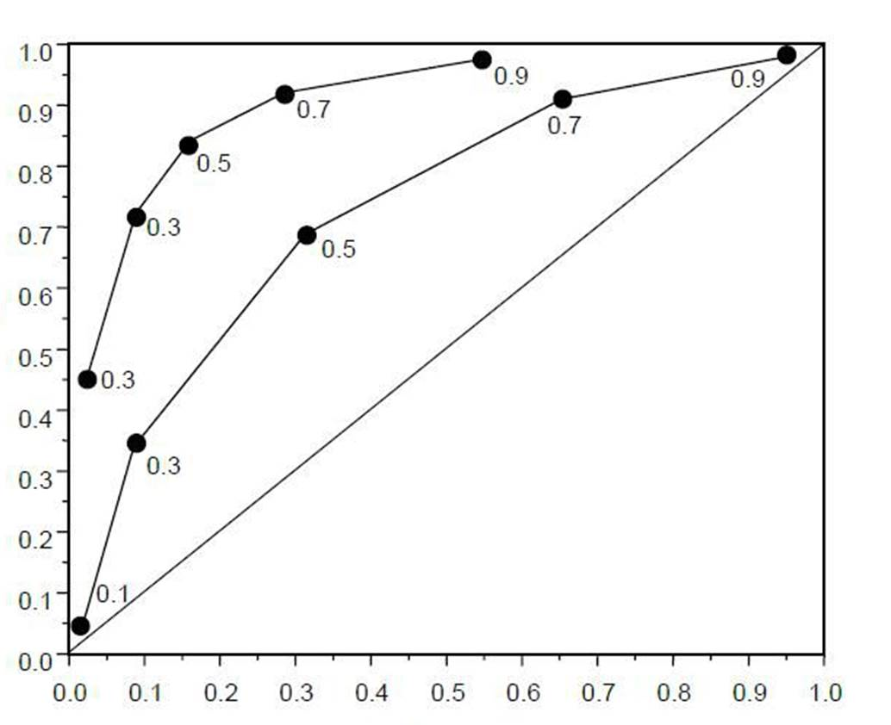
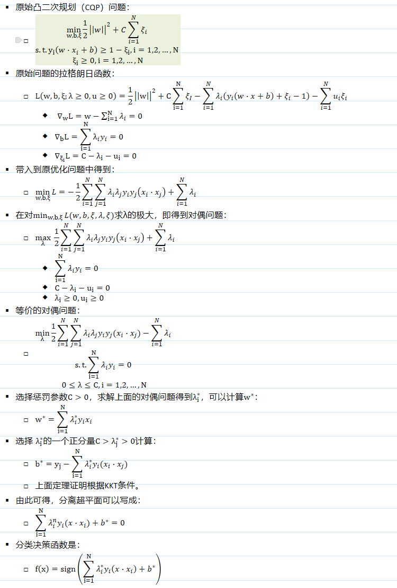

# 机器学习

# 1 特征工程

## 1.1 什么是特征标准化

-   去除数据的单位限制和量纲大小，将其转化为无量纲的纯数值，便于不同单位或量级的指标能够进行比较和加权。
-   对数值类型的特征做归一化可以将所有的特征都统一到一个大致相同的数值区间内。 &#x20;
-   归一化是让不同维度之间的特征在数值上有一定比较性，可以大大提高分类器的准确性。

## 1.2 特征归一化的常见方法

### 1.2.1 最大最小归一化(数据归一化)

将数据映射到\[0,1]的范围：

$$
X_{norm}=\frac{X-X_{min}}{X_{max}-X_{min}}
$$

将数据映射到\[-1,1]范围：

$$
X_{norm}=\frac{X-X_{mean}}{X_{max}-X_{min}}
$$

应用场景：适用于本来就分布在有限范围内的数据，在不涉及距离度量、协方差计算、数据不符合正态分布的时候。比如图像处理中，将RGB图像转换为灰度图像后将其值限定在\[0 255]的范围。

### 1.2.2 零均值归一化(数据标准化)

将原始数据映射到均值为0、标准差为1的分布上：

$$
Z=\frac{X-\mu}{\sigma}
$$

应用场景：在分类、聚类算法中，需要使用距离来度量相似性的时候、或者使用PCA技术进行降维的时候，零均值归一化表现更好。

## 1.3 特征归一化的优缺点

### 1.3.1 优点

-   提升收敛速度：对于线性模型来说，数据归一化后，最优解的寻优过程明显会变得平缓，更容易正确的收敛到最优解。
-   提升模型的精度：这在涉及到一些距离计算的算法时效果显著，比如算法要计算欧氏距离
-   深度学习中数据归一化可以防止模型梯度爆炸。

### 1.3.2 缺点

-   数据归一化不是万能的，在实际应用中，通过梯度下降法求解的模型通常是需要数据归一化的，包括线性回归、逻辑回归、持向量机（SVM）、神经网络等模型。
-   但是决策树模型并不适用归一化。

## 1.4 树形结构不需要归一化

-   数值缩放不影响分裂点位置，对树模型的结构不造成影响。
-   树型结构不关心变量的值，只关心变量分布以及变量之间的条件概率。
-   树模型是不能进行梯度下降的，因为构建树模型（回归树）寻找最优点时是通过寻找最优分裂点完成的，因此树模型是阶跃的，阶跃点是不可导的，并且求导没意义，也就不需要归一化。

## 1.5 高维组合特征

-   目的：为了提高复杂关系的拟合能力，在特征工程中经常会把一阶离散特征两两组合，构成高阶组合特征。
-   解决维度过高问题：可以采取降维，矩阵分解或者特征筛选的方法得到具备绝大部分信息的几个特征进行训练。

## 1.6 距离公式比较

### 1.6.1 欧氏距离

欧几里得距离，就是平方和开根号，我们最常用的。欧氏距离越小，两个向量的相似度越大；欧氏距离越大，两个向量的相似度越小。

$$
d=\sqrt{\sum_{k-1}^{n}{(x_{1k}-x_{2k})^2}}
$$

### 1.6.2 曼哈顿距离

在曼哈顿距离中，考虑了更多的实际因素，一般用于城市街道距离的计算。在曼哈顿距离的世界中，规则是我们只能沿着线画出的格子行进。

$$
d_{12}=\sum_{k=1}^{n}|x_{1k}-x_{2k}|
$$

### 1.6.3 切比雪夫距离

国际象棋中， 国王可以直行、 横行、 斜行， 所以国王走一步可以移动到相邻8个方格中的任意一个。 国王从格子(x1,y1)走到格子(x2,y2)最少需要多少步？ 这个距离就叫切比雪夫距离。

$$
d_{12}=\max{|x_{1i}-x_{2i}|}
$$

### 1.6.4 闵可夫斯基距离

闵氏距离不是一种距离，而是一组距离的定义；是对多个距离度量公式的概括性的表述：

$$
d_{12}=\sqrt[p]{\sum_{k=1}^{n}{|x_{1k}-x_{2k}|^p}}
$$

当$p=1$时，就是曼哈顿距离。

当$p=2$时，就是欧式距离。

当$p\to \infty$时，就是切比雪夫距离。

### 1.6.5 马氏距离

#### 1.6.5.1 马氏距离的定义

是基于样本分布的一种距离，物理意义就是在规范化的主成分空间中的欧式距离；规范化的主成分就是利用主成分分析对一些数据进行主成分分解；再对所有主成分分解轴做归一化，形成新的坐标轴；

由这些坐标轴张成的空间就是规范化的主成分空间，若协方差矩阵S是单位矩阵（各个样本向量之间独立同分布），则马氏距离等于欧氏距离（若协方差矩阵是对角矩阵，则就是标准化欧氏距离）。

$$
d_{12}=\sqrt{(X_1-X_2)^TS^{-1}(X_1-X_2)}
$$

#### 1.6.5.2 马氏距离的优点

-   马氏距离不受量纲的影响，两点之间的马氏距离与原始数据的测量单位无关；
-   可以排除变量之间的相关性的干扰；

#### 1.6.5.3 马氏距离与欧式距离的区别

-   马氏距离考虑了各种特性之间的联系（例如：一条关于身高的信息会带来一条关于体重的信息，因为两者是有关联的）
-   马氏距离的目的就是把方差归一化，使得特征之间的关系更加符合实际情况；
-   欧式距离是计算点与点之间距离的常用方法，其缺点是坐标的各维度对计算距离的贡献是同等的；

### 1.6.6 使用余弦相似度而不是欧式距离

欧式距离衡量空间点的直线距离，余弦距离衡量点在空间的方向差异。欧式距离体现的数值上的绝对差异，而余弦距离体现方向上的相对差异。

对于两个向量$A$和$B$，其余弦相似度定义为：

$$
\cos(A,B)=\frac{AB}{|A||B|)}
$$

即两个向量夹角的余弦，关注的是向量之间的角度关系，并不关心它们的绝对大小,余弦相似度依然符合“相同为$1$，正交为$0$，相反为$-1$”的性质，其取值范围是\[-1, 1]。

## 1.7 one-hot的作用

One-Hot编码是分类变量作为二进制向量的表示。这首先要求将分类值映射到整数值。然后，每个整数值被表示为二进制向量，除了整数的索引之外，它都是零值，它被标记为1。

直接使用数字会给将人工误差而导致的假设引入到类别特征中，比如类别之间的大小关系，以及差异关系等等。

## 1.8 特征选择方法

### 1.8.1 包装式

Wrapper，根据目标函数（通常是预测效果评分），每次选择若干特征，或者排除若干特征。

### 1.8.2 嵌入式

-   Embedded，先使用某些机器学习的算法和模型进行训练，得到各个特征的权值系数，根据系数从大到小选择特征。类似于Filter方法，但是是通过训练来确定特征的优劣。
-   常见的方法：基于树的特征提取、极端随机树分类器、L1正则化、岭回归

### 1.8.3 过滤式

-   Filter，按照发散性或者相关性对各个特征进行评分，设定阈值或者待选择阈值的个数，选择特征。常见的方法有如下几种。

#### 1.8.3.1 方差过滤

这是通过特征本身的方差来筛选特征的类。比如一个特征本身的方差很小，就表示样本在这个特征上基本没有差异，可能特征中的大多数值都一样，甚至整个特征的取值都相同，那这个特征对于样本区分没有什么作用。

#### 1.8.3.2 单变量选择

单变量的特征选择是通过基于一些单变量的统计度量方法来选择最好的特征。属于过滤法的一种。

#### 1.8.3.3 卡方

卡方过滤是专门针对离散型标签(即分类问题)的相关性过滤。计算每个特征和标签之间的卡方统计量，并依照卡方统计量由高到低为特征排名。

#### 1.8.3.4 F检验

另外类似的方法还有F检验，又称ANOVA，方差齐性检验，是用来捕捉每个特征与标签之间的线性关系的过滤方法。它即可以做回归也可以做分类

#### 1.8.3.5 互信息

互信息法是用来捕捉每个特征与标签之间的任意关系(包括线性和非线性关系)的过滤方法。和F检验相似，它既可以做回归也可以做分类，并且包含两个类。互信息法不返回p值或F值类似的统计量，它返回“每个特征与目标之间的互信息量的估计”，这个估计量在\[0,1]之间取值，为0则表示两个变量独立，为1则表示两个变量完全相关。

#### 1.8.3.6 皮尔逊相关系数

该方法衡量的是变量之间的线性相关性，结果的取值区间为，-1表示完全的负相关；+1表示完全的正相关；0表示没有线性相关。

#### 1.8.3.7 多重共线性方差膨胀系数

方差膨胀系数(variance inflation factor，VIF)是衡量多元线性回归模型中复 (多重)共线性严重程度的一种度量。它表示回归系数估计量的方差与假设自变量间不线性相关时方差相比的比值。多重共线性是指自变量之间存在线性相关关系，即一个自变量可以是其他一个或几个自变量的线性组合。通常以10作为判断边界。  当VIF<10,不存在多重共线性；  当10<=VIF<100,存在较强的多重共线性；当VIF>=100, 存在严重多重共线性。

# 2 模型评估

## 2.1 回归模型的评估

### 2.1.1 均方误差

指预测值与真实值之间平均相差多大。能更好的反应预测值误差的实际情况。

$$
MAE=\frac{\sum_{i=1}^m|f_i-y_i|}{m}
$$

### 2.1.2 平均绝对误差

观测值与真实值偏差的平方和与观测样本比值。模型之间的对比也可以用它来比较。均方误差可以评价数据的变化程度，MSE越小 *，* 说明预测模型描述试验数据具有更好的精确度。

$$
MAE=\frac{\sum_{i=1}^m(f_i-y_i)^2}{m}
$$

### 2.1.3 决定系数

分母为原始数据的离散程度，分子为预测数据和原始数据的偏差。二者相除可以消除原始数据离散程度的影响。理论取值(-，1]，正常取值\[0,1]。一般＞0.4，拟合效果较好，缺点：数据集的样本越大，$R^2$越大；因此不同数据集的模型结果比较会有误差。

$$
R^2=1-\frac{\sum_{i=1}^m(f_i-y_i)^2}{\sum_{i=1}^m(y_i-\bar{y})^2}
$$

### 2.1.4 矫正决定系数

$n$为样本量，$p$为特征数量，消除了样本数据和特征数据的影响。

$$
R^2_{adj}=1-\frac{(1-R^2)(n-1)}{n-p-1}
$$

## 2.2 分类模型的评估

### 2.2.1 准确率、精确率、召回率、F1-score

-   准确率（Accuracy）：对于给定的测试集，分类模型正确分类的样本数与总样本数之比；
-   精确率（Precision）：对于给定测试集的某一个类别，分类模型预测正确的比例，或者说分类模型预测的正样本中有多少是真正的正样本；
-   召回率（Recall）：对于给定测试集的某一个类别，样本中的正类有多少被分类模型预测正确召回率的定义为：对于给定测试集的某一个类别，样本中的正类有多少被分类模型预测正确；
-   F1-score：在理想情况下，我们希望模型的精确率越高越好，同时召回率也越高越好，但是现实情况下，精确率和召回率往往出现一个值升高，另一个值降低，那么，用一个指标来综合考虑精确率和召回率，这个指标就是F值。F值的计算公式为：

$$
F=\frac{(a^2+1)*P*R}{a^2*(P+R)} 
$$

式中：P: Precision， R: Recall, a：权重因子。当a=1时，F值便是F1值，代表精确率和召回率的权重是一样的，是最常用的一种评价指标。

### 2.2.2 混淆矩阵

| 混淆矩阵 |           | Predict          | Predict         |
| ---- | --------- | ---------------- | --------------- |
|      |           | 正例(positive)     | 反例(negative)    |
| True | 正例(ture)  | TP（真正例）          | FN（假反例）(Type I) |
| True | 反例(false) | FP（假正例）{Type II} | TN（真反例）         |

#### *混淆矩阵的一级指标*

-   *真实值是positive，模型认为是positive的数量（True Positive=TP）；*
-   *真实值是positive，模型认为是negative的数量（False Negative=FN）：这就是统计学上的第一类错误（Type I Error）；*
-   *真实值是negative，模型认为是positive的数量（False Positive=FP）：这就是统计学上的第二类错误（Type II Error）；*
-   *真实值是negative，模型认为是negative的数量（True Negative=TN）*

#### 2.2.2.2 混淆矩阵的二级指标

| 指标       | 公式                                    | 意义                            |
| -------- | ------------------------------------- | ----------------------------- |
| 准确率(ACC) | $Accuracy=\frac{TP+TN}{TP+TN+FP+FN}$  | 分类模型所有判断真确的结果占总观测值的比重         |
| 精确率(PPV) | $Precision=\frac{TP}{TP+FP}$          | 在模型预测是Positive的所有结果中，模型预测对的比重 |
| 灵敏度(TPR) | $Sensitivity=Recall=\frac{TP}{TP+FN}$ | 在真实值是Positive的所有结果中，模型预测对的比重  |
| 特异度(TNR) | $Specificity=\frac{TN}{TN+FP}$        | 在真实值是Negative的所有结果中，模型预测对的比重  |

#### 2.2.2.3 混淆矩阵的三级指标

F1-score，用一个指标来综合考虑精确率和召回率。

### 2.2.3 ROC和AUC

#### 2.2.3.1 ROC曲线图

*与P-R曲线相似，根据学习器的预测结果对样本进行排序，按照此顺序逐个把样本作为正例进行预测，每次计算出两个重要量的值，分别以他们为横纵轴作图，就得到ROC曲线。*

-   纵轴为真正例率（TPR），横轴为假正例率（FPR）。
-   $TPR=TP/(TP+FN)$
-   $FPR=FP/(TN+FP)$

#### 2.2.3.2 AUC定义

AUC就是ROC 曲线下的面积，通常情况下数值介于0.5-1之间，可以评价分类器的好坏，数值越大说明越好。

*AUC值是一个概率值，当你随机挑选一个正样本以及一个负样本，当前的分类算法根据计算得到的Score值将这个正样本排在负样本前面的概率就是AUC值。当然，AUC值越大，当前的分类算法越有可能将正样本排在负样本前面，即能够更好的分类。*

#### 2.2.3.3 AUC评价

-   $AUC=1$，完美分类器；
-   $0.5<AUC<1$，优于随机猜测，有预测价值；
-   $AUC=0.5$，跟随机预测一样，无预测价值；
-   $AUC<0.5$，比随机预测差，不存在。

## 2.3 模型评估的验证方法

-   训练集，测试集，验证集
-   Holdout检验
-   交叉验证
-   自助法

## 2.4 超参数调优

### 2.4.1 网格搜索

-   简单尝试每种可能配置的朴素方法。

#### 2.4.1.1 工作流如下

-   \*定义一个 *$n$* 维的网格，其中每格都有一个超参数映射。例如 \*$n = (learning\_rate, dropout\_rate, batch\_size)$
-   \*对于每个维度，定义可能的取值范围：例如 \*$batch_size = [4,8,16,32,64,128,256 ]$
-   \*搜索所有可能的配置并等待结果去建立最佳配置：例如 \*$ C1 = (0.1, 0.3, 4) -> acc = 92%, C2 = (0.1, 0.35, 4) -> acc = 92.3%  $*等...*

#### 2.4.1.2 优缺点

-   *这种平行策略令人尴尬，因为它忽略了计算历史（我们很快就会对此进行扩展）。但它的本意是，你拥有的计算资源越多，你可以同时尝试的猜测就越多！*
-   *这种方法的真正痛点称为 curse of dimensionality（维数灾难）。这意味着我们添加的维数越多，搜索在时间复杂度上会增加得越多（通常是指数级增长），最终使这个策略变得不可行！*
-   *当超参数维度小于或等于 4 时，通常使用这种方法。但实际上，即使它保证在最后找到最佳配置，它仍然不是首选方案。*

### 2.4.2 随机搜索

网格搜索和随机搜索之间唯一真正的区别在于策略周期的第 1 步 - 随机搜索从配置空间中随机选取点。

#### 2.4.2.1 评价

-   *图像通过在两个超参数空间上搜索最佳配置来比较两种方法。它还假设一个参数比另一个参数更重要。这是一个安全的假设，因为开头提到的深度学习模型确实充满了超参数，并且研究员/科学家/学生一般都知道哪些超参数对训练影响最大。*
-   *在网格搜索中，很容易注意到，即使我们已经训练了 9 个模型，但我们每个变量只使用了 3 个值！然而，使用随机布局，我们不太可能多次选择相同的变量。结果是，通过第二种方法，我们将为每个变量使用 9 个不同的值训练 9 个模型。*
-   *从每个图像布局顶部的曲线图可以看出，我们使用随机搜索可以更广泛地探索超参数空间（特别是对于更重要的变量）。这将有助于我们在更少的迭代中找到最佳配置。*

#### 2.4.2.2 总结

*如果搜索空间包含 3 到 4 个以上的维度，请不要使用网格搜索。相反，使用随机搜索，它为每个搜索任务提供了非常好的基准。*

### 2.4.3 贝叶斯优化算法

## 2.5 过拟合与欠拟合

### 2.5.1 过拟合

-   过拟合的表现：训练集上表现很好，测试集上表现很差，会导致高方差（Variance）；
-   过拟合的原因：
    -   最常见的情况是由于学习能力过于强大，以至于把训练样本所包含的不一般的特性都学到了；
    -   训练集和测试集特征分布不一致；
    -   在有限的样本中搜索过大的参数空间；
    -   训练过程中函数过多吸收了噪音数据的影响；
-   解决过拟合的方法：
    -   从数据入手，获取更多的训练数据。使用更多的训练数据是解决过拟合问题最有效的手段。
    -   降维，丢弃一些不重要的特征变量；
    -   正则化，保留所有特征，但是减少量级或者参数大小；
    -   集成学习方法。把多个模型集成在一起，来降低单一模型的过拟合风险。

### 2.5.2 欠拟合

欠拟合的表现：训练集上表现很差，会导致高偏差（Bias），对训练样本的一般性质尚未学好；

欠拟合的原因：通常是由于学习能力低下造成的；

解决欠拟合的方法：欠拟合比较容易克服；例如在决策树中扩展分支，在神经网络中增加训练轮数；

-   添加新特征，可以考虑加入进特征组合、高次特征，来增大假设空间。
-   增加模型复杂度，尝试非线性模型，比如核SVM 、决策树、DNN等模型。
-   减小正则化系数。

## 2.6 正则化

-   作用：正则化就是为了防止过拟合的。
-   引入正则化：在目标函数后面添加一个系数的“惩罚项”是正则化的常用方式，为了防止系数过大而让模型变得复杂。

    加入正则化项之后的目标函数为：$J=J+\lambda ||x||_p$，$\lambda$是一个常数。
-   先验分布：$L1$是拉普拉斯分布；$L2$是高斯（正态）分布；

## 2.7 L0, L1, L2的区别

### 2.7.1 范数定义

*范数是一个函数，是矢量空间内的所有矢量赋予非零的正长度或大小。*

$$
||x||_p=\left(\sum_{i=1}^{n}{|x_i|^p}\right)^{\frac{1}{p}}
$$

### 2.7.2 L0范数

1.  当$p=0$时，是$L0$范数，其表示某个向量中非零元素的个数。
2.  因为稀疏的参数可以防止过拟合，所以用$L0$范数（非零参数的个数）来做正则化是可以防止过拟合的。
3.  利用非零参数的个数，可以很好的来选择特征，实现特征稀疏的效果，具体操作时选择参数非零的特征即可。
4.  但是L0正则化很难求解，所以一般采用L1正则化。

### 2.7.3 L1范数

1.  当$p=1$时，是$L1$范数，其表示某个向量中所有元素绝对值的和。
2.  $L1$正则化是$L0$正则化的最优凸近似，表示各个参数绝对值之和。
3.  $L1$正则化通过让原目标函数加上了所有特征系数绝对值的和来实现正则化。
4.  $L1$正则化更适用于特征选择。

### 2.7.4 L2范数

1.  当$p=2$时，是$L2$范数， 表示某个向量中所有元素平方和再开根， 也就是欧几里得距离公式。
2.  标识各个参数的平方的和的开方值。
3.  $L2$正则化通过让原目标函数加上了所有特征系数的平方和来实现正则化。
4.  $L2$正则化更适用于防止模型过拟合，不能用于特征选择。

## 2.8 什么是数据不平衡

-   *在学术研究与教学中，很多算法都有一个基本假设，那就是数据分布是均匀的。当我们把这些算法直接应用于实际数据时，大多数情况下都无法取得理想的结果。* 因为实际数据往往分布得很不均匀，都会存在“长尾现象”，也就是所谓的“二八原理”。
-   *问题根据难度从小到大排个序：大数据+分布均衡<大数据+分布不均衡<小数据+数据均衡<小数据+数据不均衡。*

## 2.9 解决数据不平衡

### 2.9.1 采样

#### 2.9.1.1 上采样（Oversampling）

-   上采样是把小众类复制多份；上采样后的数据集中会反复出现一些样本，训练出来的模型会有一定的过拟合；

#### 2.9.1.2 下采样（Undersampling）

-   下采样是从大众类中剔除一些样本，或者说只从大众类中选取部分样本；下采样的训练集丢失了数据，模型只学到了总体模式的一部分。会有一定的欠拟合。

### 2.9.2 数据合成

数据合成方法是利用已有样本生成更多样本，这类方法在小数据场景下有很多成功案例，比如医学图像分析等。

其中最常见的一种方法叫做SMOTE；

### 2.9.3 加权

*可以通过加权的方式来解决数据不平衡问题，即对不同类别的代价不同。*

*这种方法的难点在于设置合理的权重，实际应用中一般让各个分类间的加权损失值近似相等。当然这并不是通用法则，还是需要具体问题具体分析。*

### 2.9.4 一分类

*对于正负样本极不平衡的场景，我们可以换一个完全不同的角度来看待问题：把它看做一分类（One Class Learning）或异常检测（Novelty Detection）问题。这类方法的重点不在于捕捉类间的差别，而是为其中一类进行建模，经典的工作包括One-class SVM等。*

*说明：对于正负样本极不均匀的问题，使用异常检测，或者一分类问题，也是一个思路。*

### 2.9.5 换一种评价指标

*通常情况下,我们会使用准确率(Accuracy)和误差(Cost)两种方式来判断机器学习的成果。但是在不均衡的数据面前,高的准确率和低的误差就显得没有那么有用和重要了。*

*对于数据极端不平衡时，可以观察不同算法在同一份数据下的训练结果的precision和recall，*

*这样做有两个好处：*

-   一是可以了解不同算法对于数据的敏感程度；
-   二是可以明确采取哪种评价指标更合适；

*针对机器学习中的数据不平衡问题，建议更多PR(Precision-Recall曲线)，而非ROC曲线，具体原因画图即可得知，如果采用ROC曲线来作为评价指标，很容易因为AUC值高而忽略实际对少两样本的效果其实并不理想的情况。*

## 2.10 如何选择不平衡问题解决方法

-   *在**正负样本都非常之少**的情况下，应该采用**数据合成**的方式；*
-   *在负样本足够多，正样本非常之少且比例极其悬殊的情况下，应该考虑一分类方法；*
-   *在正负样本都**足够多且比例不是特别悬殊**的情况下，应该考虑**采样或者加权**的方法。*
-   *采样和加权在数学上是等价的，但实际应用中效果却有差别。尤其是采样了诸如Random Forest等分类方法，训练过程会对训练集进行随机采样。在这种情况下，如果计算资源允许上采样往往要比加权好一些。*
-   *另外，虽然上采样和下采样都可以使数据集变得平衡，并且在数据足够多的情况下等价，但两者也是有区别的。实际应用中，我的经验是如果计算资源足够且小众类样本足够多的情况下使用上采样，否则使用下采样，因为上采样会增加训练集的大小进而增加训练时间，同时小的训练集非常容易产生过拟合。*
-   *对于下采样，如果计算资源相对较多且有良好的并行环境，应该选择Ensemble方法。*

# 3 逻辑回归

## 3.1 Sigmoid函数

也叫逻辑函数，logistic函数，S形函数。即逻辑斯蒂分布的密度函数。

### 3.1.1 函数形式

$$
g(z)=\frac{e^z}{1+e^z}=\frac{1}{1+e^{-z}}
$$

### 3.1.2 函数意义

-   可以看到$sigmoid$函数是一个s形曲线，连续，光滑，严格单调，关于$  (0,0.5) $对称。
-   定义域为$(-\infty,+\infty)$，值域为$[0, 1]$，在远离$0$的地方函数的值会很快接近0或者1。

### 3.1.3 决策方式

$$
\begin{equation*}
y=\begin{cases}
1,&z>0;\\
0.5,&z=0;\\0,&z<0;
\end{cases}
\end{equation*}
$$

## 3.2 LR的公式

$$
P(Y=1|x)=\frac{1}{1+e^{-(w^Tx+b)}}=\frac{e^{w^Tx+b}}{1+e^{w^Tx+b}}
$$

考虑具有个$n$独立变量的向量$X=(x_1,…,x_n)$，设条件慨率$P(y=1│x)=p$为根据观测量相对于某事件$X$发生的概率。条件慨率$P(y=0│x)=1−p$为根据观测量相对于某事件$X$不发生的概率。

-   在$X$条件下$y$发生的概率：
    $$
    \begin{equation*}
    \begin{split}
    P(y=1│X)&=\frac{1}{1+e^{−z(x)}}\\&=\frac{1}{1+e^{−(θ_1 x_1+…+θ_n x_n)}}\\&=\frac{1}{1+e^{−θ^T X}}\\&=g(z)
    \end{split}
    \end{equation*}
    $$
-   在X条件下y不发生的概率：
    $$
    \begin{equation*}\begin{split}P(y=0│X)&=1−P(y=1│X)\\&=1−\frac{1}{1+e^{−θ^T X}}\\&=\frac{1+e^{−θ^T X}}{(1+e^{−θ^T X}}−\frac{1}{1+e^{−θ^T X}}\\&=\frac{e^{−θ^T X}}{1+e^{−θ^T X}}\\&=\frac{1}{1+e^{θ^T X}}\\&=1−g(z)\end{split}\end{equation*}
    $$

## 3.3 LR与线性回归对比

1.  逻辑回归处理分类问题，线性回归处理回归问题，这是两者最本质的区别。
    -   逻辑回归因变量取值是一个二元分布，模型学习得出的是$E(y|x;\theta)$，即给定自变量和超参数后，得到应变量的期望，并基于此期望来处理预测分类问题；
    -   线性回归实际上求解的是$y'=\theta^Tx$，是对假设的真实关系$y=\theta^Tx+\epsilon$的一个近似，用这个近视项来处理回归问题；
2.  逻辑回归的因变量为离散的，而线性回归中因变量是连续的。关于逻辑回归的讨论中，均认为y是因变量，而非$\frac{p}{1-p}$，这便引出逻辑回归与线性回归最大的区别。
    -   在自变量$x$和超参数$\theta$确定的情况下，逻辑回归可以看作广义线性模型在因变量y服从二元分布(伯努利分布)时的一个特殊情况；
    -   而使用最小二乘法求解线性回归时，认为因变量y服从正态分布(高斯分布)；
3.  对逻辑回归中，可以得到$log⁡\frac{p}{1−p}=θ^T X$中$p=P(y=1│X)$，也就是将给定输入x预测正样本的概率。如果把一个事件的几率定义为该事件发生的概率与该事件不发生的概率的比值$\frac{p}{1−p}$，那么逻辑回归可以看作是对于$y=1|x$这一事件的对数几率的线性回归。
4.  逻辑回归与线性回归有很多相同之处，去除$Sigmoid$映射函数的话，逻辑回归算法就是一个线性回归。逻辑回归是以线性回归为理论支持的，但是逻辑回归通过$Sigmoid$函数引入了非线性因素，因此可以轻松处理$0/1$分类问题。
5.  可以认为二者都使用了极大似然估计来对训练样本进行建模。线性回归使用最小二乘法，实际上就是在自变量$x$与超参数$θ$确定，因变量$y$服从正态分布的假设下，使用极大似然估计的一个化简；另外，二者在求解超参数的过程中，都可以使用梯度下降的方法

## 3.4 LR的损失函数

得到一个观测结果的概率（根据y服从伯努利分布的概率函数得）：

$$
f(x)=P(y_i)=p(y_i=1|x_i)^{y_i}p(y_i=0|x_i)^{1-y_i}=p_i^{y_i}(1-p_i)^{1-y_i}
$$

-   因为各样本相互独立，那么它们的联合分布为各边缘分布的乘积。得到似然函数为：
    $$
    L(\theta)=\prod_{i=1}^n[p_i]^{y_i }[1−p_i ]^{1−y_i}=∏_{i=1}^ng{(z_i) }^{y_i}{(1−g{(z_i )})}^{1−y_i}
    $$
-   取对数似然函数：
    $$
    \begin{equation*} \begin{split} l(θ)&=log⁡(L(θ))=\sum_{i=1}^n[y_i log⁡(p_i)+(1−y_i)log⁡(1−p_i)] \\&=\sum_{i=1}^n[y_i log⁡[g(z_i)]+(1−y_i) log⁡(1−g(z_i ))]\\&=\sum_{i=1}^n[y_ilog⁡(p_i )+log⁡(1−p_i)−y_i log⁡(1−p_i )]\\&=\sum_{i=1}^n\left[y_i log⁡\frac{p_i}{1−p_i }+log⁡(1−p_i)\right]\\&=\sum_{i=1}^n\left[y_i z(x)+log⁡(1−p_i)\right]\\&=\sum_{i=1}^n\left[y_i z(x)+log⁡(1−\frac{1}{1+e^{−θ^T X}})\right]\\&=\sum_{i=1}^n\left[y_i z(x)+log⁡(\frac{1}{1+e^{θ^T X}}) \right]\\&=\sum_{i=1}^n\left[y_i z(x)−log⁡(1+e^{θ^T X} ) \right] \end{split} \end{equation*}
    $$
-   取对数似然函数l(θ)的极大值，得到θ的估计值：
    -   问题则变成了以对数似然函数为目标函数的最优化问题。
    -   通常采用的是梯度下降法及拟牛顿法。

## 3.5 LR没有误差项和偏差

### 3.5.1 线性回归模型

$$
y=xβ+ϵ
$$

-   误差项ε表示不确定性，太多未知，甚至不可控因素，不能被模型所解释。如果没得误差项，就是一个数学公式。

### 3.5.2 逻辑回归模型

$$
P(Y=1)=\frac{e^z}{1+e^z}=f(a+bx)
$$

-   因为逻辑回归模型表示的含义就是Y=1的概率。不确定性仍然存在。
-   如果要$ε$，有：
    -   $P(Y=1│ϵ)=f(a+bx+ϵ)$
    -   $P(Y=1)=E\{P(Y=1│ϵ\}=Ef(a+bx+ϵ)=f^∗ (a+bx)$
-   逻辑回归因变量的均值是成功事件的概率，这个概率就是等于模型右边的标准逻辑分布函数，在右边再加一个误差项的话模型等式两边就不相等了。经典线性回归模型等式右边要是没有误差项的话那左边的因变量y就只能等于均值，这肯定是不对的，因为$y$是在均值附近变动的，所以模型的右边必然有一个误差项。
-   误差项是$p$的函数，所以，可以说没有传统意义上的误差项。如果用潜在变量理解。则有误差项，误差项服从逻辑斯蒂分布。

## 3.6 LR处理多分类问题

如果一个样本只对应于一个标签，我们可以假设每个样本属于不同标签的概率服从于几何分布，使用多项逻辑回归（ Softmax Regression ) 来进行分类。当存在样本可能居于多个标签的情况时，我们可以训练 k个二分类的逻辑回归分类器。第l个分类器用以区分每个样本是否可以归为第i类，训练该分类器时，需要把标签重新整理为“第 i 类标签” 与“非第i类标签”两类。 遇过这样的办法，我们就解决了每个样本可能拥有多个标签的情况。

## 3.7 LR的优缺点

### 3.7.1 优点

-   实现简单，易于理解和实现；
-   计算代价不高，速度很快，存储资源低；
-   其模型简单和模型的可解释性强。

### 3.7.2 缺点

-   容易欠拟合。
-   分类精度可能不高。

# 4 朴素贝叶斯

## 4.1 贝叶斯定理

### 4.1.1 全概率公式

$$
P(A)=\sum_{i=1}^nP(A,B_i)
$$

### 4.1.2 条件概率

$$
P(A|B)=P(A,B)/P(B)
$$

$$
P(B|A)=P(A,B)/P(A)
$$

$$
P(A,B)=P(A|B)*P(B)=P(B|A)*P(A)
$$

### 4.1.3 贝叶斯公式

$$
P(A|B)=\frac{P(A)P(B|A)}{P(B)}
$$

$$
P(A_i|B)=\frac{P(B|A_i)P(A_i)}{\sum_{i=1}^n{P(B|A_i)P(A_i)}}
$$

## 4.2 朴素贝叶斯原理

朴素贝叶斯采用属性条件独立性的假设，对于给定的待分类观测数据X,计算在X出现的条件下，各个目标类出现的概率（即后验概率），将该后验概率最大的类作为X所属的类。

而计算后验概率的贝叶斯公式为：

$$
p(A|B) =\frac{p(A) * p(B|A)}{p(B)}
$$

因为$p(B)$表示观测数据$X$出现的概率，它在所有关于$X$的分类计算公式中都是相同的，所以我们可以把$p(B)$忽略，则：

$$
p(A|B)= p(A) * p(B|A)
$$

## 4.3 NB的为什么朴素

朴素贝叶斯中的朴素可以理解为是“简单、天真”的意思，因为“朴素”是假设了特征之间是同等重要、相互独立、互不影响的，但是在我们的现实社会中，属性之间并不是都是互相独立的，有些属性也会存在性，所以说朴素贝叶斯是一种很“朴素”的算法。

## 4.4 NB没有超参数

朴素贝叶斯没有超参数可以调的，所以它不需要调参，朴素贝叶斯是根据训练集进行分类，分类出来的结果基本上就是确定了的；

拉普拉斯估计器不是朴素贝叶斯中的参数，不能通过拉普拉斯估计器来对朴素贝叶斯调参。

## 4.5 NB的工作流程

朴素贝叶斯的工作流程可以分为三个阶段进行，分别是准备阶段、分类器训练阶段和应用阶段。

1.  准备阶段：*这个阶段的任务是为朴素贝叶斯分类做必要的准备，主要工作是根据具体情况确定特征属性，并对每个特征属性进行适当划分，去除高度相关性的属性(如果两个属性具有高度相关性的话，那么该属性将会在模型中发挥了2次作用，会使得朴素贝叶斯所预测的结果向该属性所希望的方向偏离，导致分类出现偏差)，然后由人工对一部分待分类项进行分类，形成训练样本集合。这一阶段的输入是所有待分类数据，输出是特征属性和训练样本。(这一阶段是整个朴素贝叶斯分类中唯一需要人工完成的阶段，其质量对整个过程将有重要影响。)*
2.  分类器训练阶段：*这个阶段的任务就是生成分类器，主要工作是计算每个类别在训练样本中的出现频率及每个特征属性划分对每个类别的条件概率估计，并将结果记录。其输入是特征属性和训练样本，输出是分类器。这一阶段是机械性阶段，根据前面讨论的公式可以由程序自动计算完成。*
3.  应用阶段：*这个阶段的任务是使用分类器对待分类项进行分类，其输入是分类器和待分类项，输出是待分类项与类别的映射关系。这一阶段也是机械性阶段，由程序完成。*

## 4.6 NB的模型分类

-   高斯模型，对连续型数据进行处理；
-   多项式模型，对离散型数据进行处理，计算数据的条件概率(使用拉普拉斯估计器进行平滑的一个模型)；
-   伯努利模型，伯努利模型的取值特征是布尔型，即出现为ture,不出现为false,在进行文档分类时，就是一个单词有没有在一个文档中出现过。

## 4.7 NB对异常值不敏感

朴素贝叶斯对异常值不敏感。所以在进行数据处理时，我们可以不去除异常值，因为保留异常值可以保持朴素贝叶斯算法的整体精度，而去除异常值则可能在进行预测的过程中由于失去部分异常值导致模型的泛化能力下降。

## 4.8 NB的优缺点

### 4.8.1 优点

1.  朴素贝叶斯模型发源于古典数学理论，有稳定的分类效率。
2.  对缺失数据不太敏感，算法也比较简单，常用于文本分类。
3.  分类准确度高，速度快。
4.  对小规模的数据表现很好，能处理多分类任务，适合增量式训练，当数据量超出内存时，我们可以一批批的去增量训练(朴素贝叶斯在训练过程中只需要计算各个类的概率和各个属性的类条件概率，这些概率值可以快速地根据增量数据进行更新，无需重新全量计算)。

### 4.8.2 缺点

1.  对训练数据的依赖性很强，如果训练数据误差较大，那么预测出来的效果就会不佳。
2.  理论上，朴素贝叶斯模型与其他分类方法相比具有最小的误差率。 但是在实际中，因为朴素贝叶斯“朴素，”的特点，导致在属性个数比较多或者属性之间相关性较大时，分类效果不好。 而在属性相关性较小时，朴素贝叶斯性能最为良好。
3.  需要知道先验概率，且先验概率很多时候是基于假设或者已有的训练数据所得的，这在某些时候可能会因为假设先验概率的原因出现分类决策上的错误。

# 5 支持向量机

## 5.1 SVM概述和类别

SVM是一种二类分类模型，它的基本模型是在特征空间种寻找间隔最大化的分离超平面的线性分类器。（不加核函数的话就是个线性模型，加了之后才会升级为一个非线性模型）

-   当训练样本线性可分时，通过硬间隔最大化，学习一个线性分类器，即线性可分支持向量机；
-   当训练数据近似线性可分时，引入松弛变量通过软间隔最大化，学习一个线性分类器，即线性支持向量机；
-   当训练数据线性不可分时，通过使用核技巧及软间隔最大化，即非线性支持向量机；

## 5.2 SVM的大致过程

核心思想：在两类数据间找到一个线性“超平面”，使其与两类数据间隔最远；

1.  设立两个超平面函数，并用函数表示他们之间的距离关系；
2.  将求解支持平面最大距离的问题转化为凸优化问题，因为有了要求解的距离函数，但是此时该函数需要服从一定的情况（就是两个面不能越过支撑点，该约束条件明显是一个不等式，所以用KKT条件来做优化，如果是等式约束就用拉格朗日算子来做优化）；
3.  利用KKT条件法解决凸优化问题（在原来的目标函数中引入拉格朗日乘子法，变为优化的目标函数）（将有约束条件的函数最优化问题通过拉格朗日函数转化为无条件的函数最优化问题）；
4.  对式子求梯度，并且当梯度为0时，该式可以取得最大值。

## 5.3 SVM 为什么采用间隔最大化（与感知机的区别）

当训练数据线性可分时，存在无穷个分离超平面可以将两类数据正确分开。感知机利用误分类最小策略，求得分离超平面，不过此时的解有无穷多个。线性可分支持向量机利用间隔最大化求得最优分离超平面，这时，解是唯一的。另一方面，此时的分隔超平面所产生的分类结果是最鲁棒的，对未知实例的泛化能力最强。

## 5.4 函数间隔与几何间隔

$|wx+b|$能够相对的表示点$x$距离超平面的远近。而$w∙x+b$的符号与类标记$y$的符号是否一致表示分类是否正确。

### 5.4.1 函数间隔

对于训练集$T$和超平面$(w,b)$，定义超平面$(w,b)$关于样本点$(x_i,y_i)$的函数间隔为：

$$
\hat{\gamma}_i=y_i(wx_i+b) 。
$$

定义超平面$(w,b)$关于训练集$T$的函数间隔为超平面$(w,b)$关于$T$中所有样本点的函数间隔之最小值，即：

$$
\hat{\gamma}=\min_{i=1,...,N}\hat{\gamma_i}=\min_{i=1,...,N}y_i(\omega x_i+b)
$$

**注意：** 只要成比例的改变w和b，超平面没有改变，但函数间隔却成为原来的2倍。可以表示分类预测的确信程度。

### 5.4.2 几何间隔

对分离超平面的法向量$w$加约束，如规范化，$||w||=1$，使得间隔是确定的，这时函数间隔就成为几何间隔：

$$
\gamma_i=y_i(\frac{w}{||w||}x_i+\frac{b}{||w||}) 。
$$

定义超平面关于训练集T的几何间隔为超平面关于T中所有样本点的函数间隔之最小值，即：

$$
{\gamma}=\min_{i=1,...,N}{y_i(\frac{w}{||w||}x_i+\frac{b}{||w||})}
$$

### 5.4.3 函数间隔与几何间隔的关系

$$
r_i=\frac{\hat{r}_i}{||w||}
$$

-   如果$||w||=1$，那么函数间隔和几何间隔相等。
-   如果超平面参数$w$和$b$成比例的改变（超平面没有改变），函数间隔也按此比例改变，但几何间隔不变。

## 5.5 支持向量和间隔边界

### 5.5.1 支持向量

-   在线性可分情况下，训练集的样本点中与分离超平面距离最近的样本点的实例称为支持向量。
    $$
    y_i(wx_i+b)-1=0
    $$
-   对$y_i=+1$的正样本，支持向量在超平面为：
    $$
    H1:wx+b=1
    $$
-   对$y_i=-1$的负样本，支持向量在超平面为：
    $$
    H2:wx+b=-1
    $$
-   $H1$和$H2$平行，并且他们中间没有样本点。在$H1$和$H2$之间形成一条长带，分离超平面与他们平行且位于他们中央。

### 5.5.2 间隔边界

-   $H1$与$H2$之间的距离称为间隔（margin）。
-   间隔依赖于分离超平面的法向量$w$，等于$\frac{2}{||w||}$。$H1$和$H2$称为间隔边界。

在决定分离超平面时只有支持向量起作用，其它样本点并不起作用。支持向量的个数一般很少，所以支持向量机由很少的“重要的”训练样本确定。

## 5.6 间隔最大化

能够正确划分训练集并且几何间隔最大的分离超平面。几何间隔最大的分离超平面是唯一的，这里的间隔最大化又称为硬间隔最大化。

### 5.6.1 最大间隔分离超平面

-   最大间隔分离超平面可以表示为一个约束最优化问题：最大化超平面关于训练集的几何间隔$γ$，约束条件表示的是超平面关于每个训练样本点的几何间隔至少是$γ$。
    $$
    \max_{w,b}\gamma\\
    s.t.: y_i(\frac{w}{||w||}x_i+\frac{b}{||w||})\ge \gamma_i 
    $$
-   函数间隔的取值并不影响最优化问题，取$\hat{\gamma}=1$,产生一个等价的最优化问题：
    $$
    \max_{w,b}\frac{1}{2}||w||^2
    \\
     s.t.:y_i(wx_i+b)-1\ge0 
    $$
    -   这是一个凸二次规划CQP问题（convex quadratic programming）。
-   求得最优的$w^*,b^*$。

### 5.6.2 最大间隔分离超平面存在唯一性

若训练集线性可分，则可将训练集中的样本点完全正确分开的最大间隔分离超平面存在且唯一。

## 5.7 SVM的目标（硬间隔）

有两个目标：第一个是使间隔最大化，第二个是使样本正确分类，由此推出目标函数：

目标一（使间隔最大化）：$\min_{w,b}{\frac{1}{2}||w||^2}$

目标二（使样本正确分类）：$y_i(w^Tx_i+b)\ge1,i=1,2,...,m$

w是超平面参数，目标一是从点到面的距离公式化简来的，具体不展开；目标二就相当于感知机，只是把大于等于0进行缩放变成了大于等于1，为了后面的推导方便。写在一起，就变成了SVM的终极目标：

$$
\min_{w,b}{\frac{1}{2}||w||^2}\\
s.t. : y_i(w^Tx_i+b)\ge1,i=1,2,...,m 
$$

## 5.8 求解目标（硬间隔）

这是一个有约束的最优化问题，上式的拉格朗日函数为：

$$
\min_{w,b}\max_{\alpha}{L(w,b,\alpha)=\frac{1}{2}||w||^2+\sum_{i=1}^m\alpha_i[1-y_i(w^Tx_i+b)]}\\
s.t.:\alpha_i\ge0 
$$

在满足Slater定理的时候，且过程满足KKT条件的时候，原问题转换成对偶问题：

$$
\max_{\alpha}\min_{w,b}{L(w,b,\alpha)=\frac{1}{2}||w||^2+\sum_{i=1}^m\alpha_i[1-y_i(w^Tx_i+b)]}\\
s.t.:\alpha_i\ge0 
$$

先求内部最小值，对$w$和$b$求偏导并令其等于$0$可得：

$$
w=\sum_{i=1}^m{\alpha_iy_ix_i} \\
0=\sum_{i=1}^m{\alpha_iy_i} 
$$

将其代入到上式中去可得到：

$$
\max_{\alpha}L(w,b,\alpha)=\sum_{i=1}^m{\alpha_i}-\frac{1}{2}\sum_{j=1}^m{\alpha_i\alpha_jy_iy_jx_i^Tx_j}\\
s.t.:\sum_{i=1}^m{\alpha_iy_i}=0(\alpha_i\ge0,i=1,2,...,m) 
$$

此时需要求解$\alpha$，利用SMO（序列最小优化）算法：

SMO算法的基本思路是每次选择两个变量$\alpha_i$和$\alpha_j$，选取的两个变量所对应的样本之间间隔要尽可能大，因为这样更新会带给目标函数值更大的变化。SMO算法之所以高效，是因为仅优化两个参数的过程实际上仅有一个约束条件，其中一个可由另一个表示，这样的二次规划问题具有闭式解。

## 5.9 SVM硬间隔推导

-   输入：$T={(x_1,y_1 ),…,(x_N,y_N )},y_i∈\{−1,+1\}$
-   输出：最大间隔分离超平面、分类决策函数
-   间隔最大化表达式：

    最大间隔分离超平面可以表示为一个约束最优化问题：最大化超平面关于训练集的几何间隔$γ$，约束条件表示的是超平面关于每个训练样本点的几何间隔至少是$γ$。
    $$
    \max_{w,b}\gamma\\
    s.t.: y_i(\frac{w}{||w||}x_i+\frac{b}{||w||})\ge \gamma_i 
    $$
-   求解间隔最大化的凸二次规划CQP问题：
    $$
    \min_{w,b}⁡ \left[\frac{1}{2} ||w||^2:y_i (wx+b)−1≥0,i∈{1,…,N}\right] \to (w^∗,b^∗ )
    $$
-   凸二次规划的对偶算法：

    求解上面的最大间隔分离超平面的凸二次规划问题，应用拉格朗日对偶性，通过求解对偶问题得到原始问题的最优解。优点：
    -   对偶问题往往更容易求解。
    -   自然引入核函数，进而推广到非线性分类问题。
        对偶算法的具[体步骤](https://www.wolai.com/9MJVGp6QYWS6LnqbcNpyv5#zo4VimuiJ6SgPeXvX997b "体步骤")：（参考李航的统计学习方法p120）
    **总体步骤：** 先求对偶问题的解$λ_i^∗$，在求原问题的解$(w^∗,b^∗)$，从而得到分离超平面和分类决策函数。

    **支持向量**：考虑原始问题和对偶问题，将训练数据集中对应于$λ_i^∗>0$的样本点$(x_j,y_j)$的实例$x_i\in R^n$称为支持向量。
-   分离超平面与分类决策函数：
    $$
    w^∗x+b=0 \\
    f(x)=sign(w^∗x+b^∗ ) 
    $$

## 5.10 SVM软间隔推导

### 5.10.1 线性不可分SVM

训练集不是线性可分的，通常情况是数据集中有一些特异点（outlier），将这些特异点去除后，剩下大部分的样本点组成的集合是线性可分的。

线性不可分意味着某些样本点不能满足函数间隔大于等于$1$的约束条件。因此，对每个样本点$(x_i,y_i)$引进一个松弛变量$ξ_i≥0$，使函数间隔加上松弛变量大于等于$1$。这样约束条件就变成：

$$
y_i(wx+b)\ge1-ξ_i
 
$$

对每个松弛变量$ξ_i$，增加一个带惩罚参数$C$的代价项。目标函数变为：

$$
1/2 ||w||^2+C∑_{i=1}^nξ_i 
$$

-   这里$C>0$称为惩罚参数，一般由应用问题决定，$C$值大时对误分类的惩罚增大，值小时对误分类的惩罚减少。
-   **最小化目标函数的意义：** 使$\frac{1}{2}||w||^2$尽量小即间隔尽量大，同时使误分类点的个数尽量大。

线性不可分问题的凸二次规划问题：

$w$的解是唯一的 ，但$b$的解可能不唯一，而是存在一个区间。

解出上面的凸二次规划问题的最优解$w^∗,b^∗$ 。

分离超平面与分类决策函数：

$$
w^∗x+b^*=0
$$

$$
f(x)=sign(w^∗x+b^∗ )
$$

称这样的模型为线性不可分支持向量机，简称线性支持向量机。显然，线性支持向量机包含线性可分支持向量机。

### 5.10.2 学习的对偶算法

求解上面的凸二次规划问题，应用拉格朗日对偶性，通过求解对偶问题得到原始问题的最优解。

### 5.10.3 支持向量

-   在线性不可分的情况下，将对偶问题的解$ λ^∗=(λ_1^∗,λ_2^∗,…,λ_N^∗ )^T  $中对应于$λ_i^∗>0$的样本点的实例$ x_i  $称为（软间隔中的）支持向量。
-   实例$ x_i  $到间隔边界的距离为：$ ξ_i/||w||  $
-   软间隔的支持向量$ x_i  $或者在间隔边界上，或者在间隔边界与分离超平面之间或者在分离超平面误分一侧。
    -   若$\alpha^*_i>C$，则$ξ_i=0$，支持向量$ x_i  $恰好落在间隔边界上；
    -   若$\alpha^*_i=C$，$0<ξ_i<1$，分类正确，$ x_i  $在间隔边界与分离超平面之间；
    -   若$\alpha^*_i=C$，$ξ_i=1$，则$ x_i  $在分离超平面上；
    -   若$\alpha^*_i=C$，$ξ_i>1$，则$ x_i  $位于分离超平面误分一侧；

### 5.10.4 合页损失函数

-   线性支持向量机学习还有另一种解释，就是最小化一下目标函数：
    $$
    ∑_{i=1}^N[1−y_i (wx_i+b)]_++λ||w||^2 
    $$
    -   下标“+”表示以下取正值的函数：$[z]_+={(z,z>0;0,z≤0)}$
-   也就是说，当样本点被真确分类且函数间隔（确信度）$y_i(wx_i+b)$大于1时，损失是0，否则损失是。&#x20;
-   合页损失函数不仅要去分类正确，而且确信度足够高时损失才是0.

## 5.11 SVM核函数的作用

当在解决线性不可分的问题时，需要通过一个映射函数 **，** 把样本值映射到更高维的空间或者无穷维，这个映射可以把低维空间中线性不可分的两类点变成线性可分的。

*在特征空间中，我们对线性可分的新样本使用前面提到过的求解线性可分的情况下的分类问题的方法时，需要计算样本内积，但是因为样本维数很高，容易造成“维数灾难”，所以这里我们就引入了核函数，把高维向量的内积转变成了求低维向量的内积问题。*

核函数和映射没有关系。核函数只是用来计算映射到高维空间之后的内积的一种简便方法。

对核函数的理解：核函数就是一个函数，接收两个变量，这两个变量是在低维空间中的变量，而核函数求的值等于将两个低维空间中的向量映射到高维空间后的内积。

## 5.12 核函数之间的区别

常见的核函数：线性核、多项式核、高斯核、拉普拉斯核、Sigmoid核

| 名称           | 表达式                                      | 参数                             |           |   |                   |                          |
| ------------ | ---------------------------------------- | ------------------------------ | --------- | - | ----------------- | ------------------------ |
| 线性核          | $k(x_i,x_j)=x_i^Tx_j$                    |                                |           |   |                   |                          |
| 多项式核         | \$ k(x\_i,x\_j)=(x\_i^Tx\_j)^T           |                                |           |   |                   |                          |
| \$           | $d≥1$为多项式的次数                             |                                |           |   |                   |                          |
| 高斯核/径向基核/RBF | \$k(x\_i,x\_j)=exp(-\frac{               |                                | x\_i-x\_j |   | ^2}{2\sigma^2})\$ | $\sigma>0$为高斯核的带宽(width) |
| 拉普拉斯核        | \$k(x\_i,x\_j)=exp(-\frac{               |                                | x\_i-x\_j |   | }{\sigma})\$      | $\sigma>0$               |
| Sigmoid核     | $k(x_i,x_j)=tanh(\beta x_i^Tx_j+\theta)$ | tanh为双曲真切函数，$\beta>0,\theta<0$ |           |   |                   |                          |

1.  线性核：主要用于线性可分的情形。参数少，速度快，对于一般数据，分类效果已经很理想了。
2.  RBF核：主要用于线性不可分的情形。参数多，分类结果非常依赖于参数。有很多人是通过训练数据的交叉验证来寻找合适的参数，不过这个过程比较耗时。

## 5.13 核函数的选择

一般用线性核和高斯核 。需要注意的是需要对数据归一化处理。

1.  如果特征的数量很大，跟样本数量差不多，这时候选用LR或者是Linear Kernel的SVM
2.  如果Feature的数量比较小，样本数量一般，不算大也不算小，选用SVM+Gaussian Kernel
3.  如果Feature的数量比较小，而样本数量很多，需要手工添加一些feature变成第一种情况

## 5.14 超参数调节

### 5.14.1  $C$

-   是惩罚系数，一般事先由应用问题决定。最小化目标函数包含两层含义：即间隔尽量大，同时使误分类点的个数尽量小，$C$是调和二者的系数。 控制目标函数中两项 （“寻找间隔最大的超平面”和“保证数据点偏差量最小”）之间的权重。
-   $C$越大时对误分类的惩罚增大，说明越不能容忍出现误差，容易过拟合。
-   $C$值小时对误分类的惩罚减小，说明不再关注分类是否正确，只要求间隔越大越好，容易欠拟合。

### $5.14.2 \gamma$

-   选择RBF函数作为kernel后，该函数自带的一个参数。
-   隐含地决定了数据映射到新的特征空间后的分布，$\gamma$越大，支持向量越少；$\gamma$值越小，支持向量越多。支持向量的个数影响训练与预测的速度。

### $5.14.3 \gamma$与 $\sigma$的关系

$$
k(x,z)=exp(-\frac{d(x-z)^2}{2\sigma^2})=exp(-\gamma\cdot d(x,z)^2) =>\gamma=\frac{1}{2\cdot \sigma^2}
$$

## 5.15 对缺失数据敏感

-   这里说的缺失数据是指缺失某些特征数据，向量数据不完整。
-   SVM 没有处理缺失值的策略。而 SVM 希望样本在特征空间中线性可分，所以特征空间的好坏对SVM的性能很重要。缺失特征数据将影响训练结果的好坏。

## 5.16 SVM的优缺点

### 5.16.1 优点

1.  由于SVM是一个凸优化问题，所以求得的解一定是全局最优而不是局部最优。
2.  不仅适用于线性线性问题还适用于非线性问题(用核技巧)。
3.  拥有高维样本空间的数据也能用SVM，这是因为数据集的复杂度只取决于支持向量而不是数据集的维度，这在某种意义上避免了“维数灾难”。
4.  *理论基础比较完善(例如神经网络就更像一个黑盒子)。*

### 5.16.2 缺点

1.  SVM算法对大规模训练样本难以实施；*由于SVM是借助二次规划来求解支持向量，而求解二次规划将涉及m阶矩阵的计算（m为样本的个数），当m数目很大时该矩阵的存储和计算将耗费大量的机器内存和运算时间。*
2.  用SVM解决多分类问题存在困难；*经典的支持向量机算法只给出了二类分类的算法，而在数据挖掘的实际应用中，一般要解决多类的分类问题。可以通过多个二类支持向量机的组合来解决。主要有一对多组合模式、一对一组合模式和SVM决策树；再就是通过构造多个分类器的组合来解决。主要原理是克服SVM固有的缺点，结合其他算法的优势，解决多类问题的分类精度。如：与粗集理论结合，形成一种优势互补的多类问题的组合分类器。*
3.  对缺失数据敏感，对参数和核函数的选择敏感；*支持向量机性能的优劣主要取决于核函数的选取,所以对于一个实际问题而言,如何根据实际的数据模型选择合适的核函数从而构造SVM算法.目前比较成熟的核函数及其参数的选择都是人为的,根据经验来选取的,带有一定的随意性.在不同的问题领域,核函数应当具有不同的形式和参数,所以在选取时候应该将领域知识引入进来,但是目前还没有好的方法来解决核函数的选取问题.*

# 6 决策树

## 6.1 决策树的原理

决策树是一种树结构，从根节点出发，每个分支都将训练数据划分成了互不相交的子集。分支的划分可以以单个特征为依据，也可以以特征的线性组合为依据。决策树可以解决回归和分类问题，在预测过程中，一个测试数据会依据已经训练好的决策树到达某一叶子节点，该叶子节点即为回归或分类问题的预测结果。

## 6.2 简述决策树的构建过程

1.  步骤一：将所有的特征看成一个一个的节点；eg（拥有房产、婚姻状态、年收入这些特征，我们可以看成一个一个的节点。）
2.  步骤二：将特征按不同属性分割（比如年龄这个特征：可以按老，中，青三个属性来划分），然后求出不同特征的信息增益/信息增益率/gini系数等，不同的树取不同的值；
3.  步骤三：使用第二步遍历所有特征，选择出最优的特征，以及该特征的最优的划分方式，得出最终的子节点$N1、 N2….Nm$；
4.  步骤四：对子节点$N1、N2….Nm$分别继续执行2-3步，直到每个最终的子节点都足够“纯”；
5.  如果下一次该节点选出来的那一个属性是刚刚其父节点分裂时用过的属性，则该节点已经达到了叶子节点，无须继续分裂了。

## 6.3 信息增益/信息增益率/基尼系数

### 6.3.1 信息熵

信息熵用来度量样本集合的纯度；信息熵值越小，D 的纯度越高。

$$
Ent(D)=-\sum_{k=1}^{|y|}{p_k\log{p_k}}
$$

### 6.3.2 信息增益

信息增益用来描述一次划分之后纯度的提升有多大。用不同的属性划分样本，会得到不同的信息增益。在 ID3 决策树算法中，我们取能使信息增益最大，即划分后纯度提升最大的属性作为当前决策树的划分属性。公式前一项为未划分时的信息增益，后一项为每个子树的信息增益乘以权重的和，权重的意义是使样本数多的子节点更重要。使用信息增益时：模型偏向于选择取值较多的特征

$$
Gain(D,a)=Ent(D)-\sum_{v=1}^V{\frac{|D^v|}{|D|}}Ent(D^v)
$$

### 6.3.3 信息增益率

使用信息增益当作代价函数会对可取值数目较多的属性有所偏好，使用信息增益率可以减小这种偏好。IV 是属性 a 的固有值，a 的可能取值数目越多（V 越大），IV(a) 的值通常越大，信息增益率就会减小。使用信息增益率时：对取值多的特征加上的惩罚，对这个问题进行了校正。

$$
GainRatio(D,a)=\frac{Gain(D,a)}{IV(a)}\\
IV(a)=-\sum_{v=1}^V\frac{|D^v|}{|D|}\log{\frac{|D^v|}{|D|}} 
$$

### 6.3.4 基尼系数

*信息熵0, logK都是值越大，数据的不确定性越大. 信息熵需要计算对数，计算量大；**信息熵是可以处理多个类别，基尼指数就是针对两个类计算的**，由于CART树是一个二叉树，每次都是选择yes or no进行划分，从这个角度也是应该选择简单的基尼指数进行计算。*

*基尼系数的问题：基尼指数偏向于多值属性;当类数较大时，基尼指数求解比较困难;基尼指数倾向于支持在两个分区中生成大小相同的测试。*

## 6.4 ID3/C4.5/CART对比

### 6.4.1 ID3算法

-   ID3算法没有考虑连续特征。比如长度，密度都是连续值无法在ID3运用。
-   ID3算法采用信息增益。偏向于取值比较多的特征；
-   ID3算法对于缺失值的情况没有做考虑；
-   ID3算法没有考虑过拟合的问题；

### 6.4.2 C4.5在ID3算法上的改进

-   连续的特征离散化；
-   使用信息增益比；
-   通过剪枝算法解决过拟合；

### 6.4.3 C4.5的不足

-   C4.5生成的是多叉树；
-   C4.5只能用于分类，如果能将决策树用于回归的话可以扩大它的使用范围；
-   C4.5由于使用了熵模型，里面有大量的耗时的对数运算，如果是连续值还有大量的排序运算；

### 6.4.4 CART算法

-   可以做回归，也可以做分类；
-   使用基尼系数来替代信息增益比；
-   CART分类树离散值的处理问题，采用的思路是不停的二分离散特征；

## 6.5 CART回归树的算法推导

*CART回归树使用的是MSE, CART分类树使用基尼系数。分类树的输出是样本的类别， 回归树的输出是一个实数。CART算法构建的一定是二叉树，ID3和5构建的不一定是二叉树。*

1.  *处理数据，通过二元切分来对数据进行切分**，比如\[1,2,3,4], 我们可以用\[1.5, 2.5, 3.5] 不等来进行切分，大于或者小于，分为两类！* ​
2.  *然后得到切分好的两个类别后，对每个类别进行均值计算，然后进行误差估计**。比如以1.5分割为\[1], \[2,3,4] 得到的均值为\[1], \[3], 所以切分点1.5 —>\[1], \[3]。同理可以得到2.5, 3.5等不同切分点切分后的均值。* ​
3.  *为了比较与选择最优切分点，我们对其取平方差误差MSE*\*，比如：1.5：\[(1-1)^2] + \[(2-3)^2 + (3-3)^2 + (4-3)^2], 由此**可以得到不同切割点的数据，选择误差最小的为最优切割点**。\*
4.  *然后继续在分好组的两个区域R1， R2继续重复以上操作**。直到满足要求。* ​

-   *多插一句嘴：* CART回归树和CART分类树逻辑是一样的，只是回归树的误差是MSE，而分类树的评价标准为gini系数。

## 6.6 决策树的优缺点

### 6.6.1 优点

-   可以可视化，易于理解和解释；
-   数据准备工作很少。其他很多算法通常都需要数据规范化，需要创建虚拟变量并删除空值等；
-   能够同时处理数值和分类数据，既可以做回归又可以做分类。其他技术通常专门用于分析仅具有一种变量类型的数据集；
-   效率高，决策树只需要一次构建，反复使用，每一次预测的最大计算次数不超过决策树的深度；
-   能够处理多输出问题，即含有多个标签的问题，注意与一个标签中含有多种标签分类的问题区别开；

### 6.6.2 缺点

-   递归生成树的方法很容易出现过拟合。
-   决策树可能不稳定，因为即使非常小的变异，可能会产生一颗完全不同的树；
-   *如果某些分类占优势，决策树将会创建一棵有偏差的树。因此，建议在拟合决策树之前平衡数据集。*

## 6.7 决策树出现过拟合的原因及解决办法

### 6.7.1 原因

-   *在决策树构建的过程中，对决策树的生长没有进行合理的限制（剪枝）；*
-   *样本中有一些噪声数据，没有对噪声数据进行有效的剔除；*

### 6.7.2 解决办法

-   选择合理的参数进行剪枝，可以分为预剪枝和后剪枝，我们一般采用后剪枝的方法；
-   利用K-folds交叉验证，将训练集分为K份，然后进行K次交叉验证，每次使用K-1份作为训练样本数据集，另外一份作为测试集；
-   减少特征；

## 6.8 如何对决策树进行剪枝

剪枝是防止决策树过拟合的方法。一棵完全生长的决策树很可能失去泛化能力，因此需要剪枝。

-   剪枝的策略：剪枝分为预剪枝和后剪枝两种，预剪枝是在构建决策树时抑制它的生长，后剪枝是决策树生长完全后再对叶子节点进行修剪。

### 6.8.1 预剪枝

-   设置一个树的最大高度/深度或者为树设置一个最大节点数，达到这个值即停止生长；
-   对每个叶子节点的样本数设置最小值，生长时叶子节点样本数不能小于这个值；
-   判断每次生长对系统性能是否有增益；

### 6.8.2 后剪枝

-   后剪枝方法是对一棵已经完全生长的决策树进行剪枝 &#x20;

### 6.8.3 预剪枝和后剪枝的优缺点比较 &#x20;

-   \*时间成本方面，预剪枝在训练过程中即进行剪枝，后剪枝要在决策树完全生长后自底向上逐一考察。显然，后剪枝训练时间更长。预剪枝更适合解决大规模问题。  \*
-   \*剪枝的效果上，预剪枝的常用方法本质上是基于贪心的思想，但贪心法却可能导致欠拟合，后剪枝的欠拟合风险很小，泛化性能更高。  \*
-   *另外，预剪枝的有些方法使用了阈值，如何设置一个合理的阈值也是一项挑战。*

## 6.9 决策树不需要进行归一化处理

-   数值缩放不影响分裂点位置，对树模型的结构不造成影响。
-   按照特征值进行排序的，排序的顺序不变，那么所属的分支以及分裂点就不会有不同。
-   树模型是不能进行梯度下降的，因为构建树模型（回归树）寻找最优点时是通过寻找最优分裂点完成的，因此树模型是阶跃的，阶跃点是不可导的，并且求导没意义，也就不需要归一化。

## *决策树与逻辑回归的区别*

-   对于拥有缺失值的数据，决策树可以应对，而逻辑回归需要挖掘人员预先对缺失数据进行处理；
-   逻辑回归对数据整体结构的分析优于决策树，而决策树对局部结构的分析优于逻辑回归；
-   逻辑回归擅长分析线性关系，而决策树对线性关系的把握较差。
-   逻辑回归对极值比较敏感，容易受极端值的影响，而决策树在这方面表现较好。
-   *应用上的区别：决策树的结果和逻辑回归相比略显粗糙。逻辑回归原则上可以提供数据中每个观察点的概率，而决策树只能把挖掘对象分为有限的概率组群。比如决策树确定17个节点，全部数据就只能有17个概率，在应用上受到一定限制。就操作来说，决策树比较容易上手，需要的数据预处理较少，而逻辑回归则要去一定的训练和技巧。*
-   *执行速度上：当数据量很大的时候，逻辑回归的执行速度非常慢，而决策树的运行速度明显快于逻辑回归。*

# 7 集成学习

## 7.1 集成学习算法的概念

*集成学习算法本身不算一种单独的机器学习算法，而是通过构建并结合多个机器学习器来完成学习任务。可以说是集百家之所长，能在机器学习算法中拥有较高的准确率，不足之处就是模型的训练过程可能比较复杂，效率不是很高。*

目前常见的集成学习算法主要有2种：

-   基于Bagging的代表算法有：随机森林；
-   基于Boosting的代表算法有：Adaboost、GBDT、XGBoost等；

## 7.2 集成学习的框架

集成学习的框架主流的有三种：

### 7.2.1 Bagging(并行)

-   *多次采样（bootstrap，有放回的随机抽样，每次从训练集中抽取一个固定大小的训练集A,随机重抽样），训练多个分类器，集体投票，旨在减小方差；*
-   *如果是分类算法预测，则T个弱学习器投出最多票数的类别或者类别之一为最终类别。*
-   *如果是回归算法，T个弱学习器得到的回归结果进行算术平均得到的值为最终的模型输出。*

### 7.2.2 Boosting(串行)

-   *基分类器层层叠加，聚焦分错的样本，旨在减小方差。*
-   *Boosting的主要思想：迭代式学习。*
-   *涉及到两个部分，加法模型和前向分步算法。加法模型就是说强分类器由一系列弱分类器线性相加而成。*
-   *前向分步就是说在训练过程中，下一轮迭代产生的分类器是在上一轮的基础上训练得来的。*

### 7.2.3 Stacking

-   *多次采样，训练多个分类器，将输出作为最后的输入特征, 由k-NN、随机森林和朴素贝叶斯基础分类器组成，它的预测结果由作为元分类器的Loqistic 回归组合。*

# 8 随机森林

## 8.1 随机森林算法思想

随机森林（Random Forest）使用多个CART决策树作为弱学习器，不同决策树之间没有关联。当进行分类任务时，新的输入样本进入，就让森林中的每一棵决策树分别进行判断和分类，每个决策树会得到一个自己的分类结果，决策树的分类结果中哪一个分类最多，那么随机森林就会把这个结果当做最终的结果。

## 8.2 随机森林算法步骤

1.  第一步：原始训练集 中有$N$个样本，且每个样本有$W$维特征。从数据集D中有放回的随机抽取$x$个样本（Bootstraping方法）组成训练子集，一共进行$w$次采样，即生成$w$个训练子集。
2.  第二步：每个训练子集形成一棵决策树，形成了一共$w$棵决策树。而每一次未被抽到的样本则组成了$w$个oob（用来做预估）。
3.  第三步：对于单个决策树，树的每个节点处从个特征中随机挑选$m(m<M)$个特征，按照结点不纯度最小原则进行分裂。每棵树都一直这样分裂下去，直到该节点的所有训练样例都属于同一类。在决策树的分裂过程中不需要剪枝。
4.  第四步：根据生成的多个决策树分类器对需要进行预测的数据进行预测。
5.  第五步：根据每棵决策树的投票结果，如果是分类树的话，最后取票数最高的一个类别；如果是回归树的话，利用简单的平均得到最终结果。

## 8.3 随机森林的随机性

随机森林的随机性体现在每棵树的训练样本是随机的，树中每个节点的特征选取也是随机选择确定的。如下：

-   随机采样：随机森林在计算每棵树时，从全部训练样本（样本数为N）中选取一个可能有重复的、大小同样为N的数据集进行训练（即Booststrap采样）。
-   特征选取的随机性：在节点分裂计算时，随机地选取所有特征的一个子集，用来计算最佳的分割方式。

## 8.4 有放回的抽样的作用

保证样本集间有重叠，若不放回，每个训练样本集及其分布都不一样，可能导致训练的各决策树差异性很大，最终多数表决无法 “求同”；

即最终多数表决相当于“求同”过程。

## 8.5 随机森林不能用全样本去训练

随机森林的基学习器是同构的，都是决策树，如果用全样本去训练m颗决策树的话；基模型之间的多样性减少，互相相关的程度增加，不能够有效起到减少方差的作用；对于模型的泛化能力是有害的。

## 8.6 RF的训练效率优于bagging

因为在个体决策树的构建过程中，Bagging使用的是“确定型”决策树，bagging在选择划分属性时要对每棵树是对所有特征进行考察；而随机森林仅仅考虑一个特征子集。

## 8.7 随机森林不需要剪枝

后剪枝是为了避免过拟合，随机森林随机选择变量与树的数量，已经避免了过拟合，没必要去剪枝了。

一般随机要控制的是树的规模，而不是树的置信度，剩下的每棵树需要做的就是尽可能的在自己所对应的数据(特征)集情况下尽可能的做到最好的预测结果。剪枝的作用其实被集成方法消解了，所以用处不大。

## 8.8 随机森林处理缺失值

-   首先，给缺失值预设一些估计值，比如数值型特征，选择其余数据的中位数或众数作为当前的估计值。
-   然后，根据估计的数值，建立随机森林，把所有的数据放进随机森林里面跑一遍。记录每一组数据在决策树中一步一步分类的路径。
-   判断哪组数据和缺失数据路径最相似，引入一个相似度矩阵，来记录数据之间的相似度，比如有$N$组数据，相似度矩阵大小就是$N*N$。
-   如果缺失值是类别变量，通过权重投票得到新估计值，如果是数值型变量，通过加权平均得到新的估计值，如此迭代，直到得到稳定的估计值。

## 8.9 随机森林与GBDT的区别

-   随机森林采用的是bagging的思想，而GBDT采用的是boosting思想；
-   组成随机森林的树可以并行生成，而GBDT只能串行生成；
-   随机森林对异常值不敏感，而GBDT对异常值非常敏感；
-   随机森林对训练集一视同仁，GBDT对训练集中预测错误的样本给与了更多关注；
-   随机森林是通过减少模型方差提高性能，而GBDT是通过减少模型偏差提高性能；
-   对于最终的输出结果随机森林采用多数投票等，而GBDT则是将所有结果累加起来或者加权累加起来；
-   组成随机森林的树可以是分类树也可以是回归树，而GBDT只能由回归树组成；

## 8.10 随机森林算法的优缺点

### 8.10.1 优点

-   训练可以高度并行化，对于大数据时代的大样本训练速度有优势。
-   由于可以随机选择决策树节点划分特征，这样在样本特征维度很高的时候，仍然能高效的训练模型。
-   在训练后，可以给出各个特征对于输出的重要性。
-   由于采用了随机采样，训练出的模型的方差小，泛化能力强。
-   相对于Boosting系列的Adaboost和GBDT， RF实现比较简单。
-   对部分特征缺失不敏感。

### 8.10.2 缺点

-   在某些噪音比较大的样本集上，RF模型容易陷入过拟合。
-   取值划分比较多的特征容易对RF的决策产生更大的影响，从而影响拟合的模型的效果。

# 9 Adaboost

## 9.1 Adaboost步骤

1.  初始化训练样本的权值分布，每个训练样本的权值应该相等（如果一共有$N$个样本，则每个样本的权值为$1/N$)
2.  依次构造训练集并训练弱分类器。如果一个样本被准确分类，那么它的权值在下一个训练集中就会降低；如果它被分类错误，那么它在下个训练集中的权值就会提高。权值更新过后的训练集会用于训练下一个分类器。
3.  将训练好的弱分类器集成为一个强分类器，误差率小的弱分类器会在最终的强分类器里占据更大的权重，否则较小。

## 9.2 Adaboost常用的损失函数

指数损失

## 9.3 Adaboost如何用于分类

1.  *计算样本权重：训练数据中的每个样本，赋予其权重，即样本权重，用向量D表示，这些权重都初始化成相等值。假设有n个样本的训练集，设定每个样本的权重都是相等的，即1/n*
2.  *计算错误率：利用第一个弱学习算法h1对其进行学习，学习完成后进行错误率ε的统计*
3.  *计算弱学习算法权重：弱学习算法也有一个权重，用向量α表示，利用错误率计算权重α：*

*α>0，错误率<0.5, 错误率越小，α越大。*

*错误率=0.5，α=1；*

*α<0:错误率很大的时候；*

1.  *更新样本权重：在第一次学习完成后，需要重新调整样本的权重，以使得在第一分类中被错分的样本的权重，在接下来的学习中可以重点对其进行学习；其中，h（xi）=yi表示对第i个样本训练正确，不等于则表示分类错误。Z是一个归一化因子：Zt=sum(D)*
2.  *重复进行学习，这样经过t轮的学习后，就会得到t个弱学习算法、权重、弱分类器的输出以及最终的AdaBoost算法的输出：*

*H(X)>0 是1类；H(X)<0 是-1类*

## 9.4 Adaboost算法的优缺点

优点：能够基于泛化性能相当弱的的学习器构建出很强的集成，不容易发生过拟合。

缺点：对异常样本比较敏感，异常样本在迭代过程中会获得较高的权值，影响最终学习器的性能表现。

## 9.5 AdaBoost与GBDT的区别

区别在于两者boosting的策略：

Adaboost通过不断修改权重、不断加入弱分类器进行boosting；

GBDT通过不断在负梯度方向上加入新的树进行boosting。

# 10 GBDT

### 10.?.1 简述GBDT原理

#### 10.?.1.1 GBDT主要由三个概念组成

-   *Regression Decistion Tree（即DT)*

    *GBDT的核心在于累加所有树的结果作为最终结果，而分类树的结果显然是没办法累加的，所以GBDT中的树都是回归树，不是分类树，这点对理解GBDT相当重要。*
-   *Gradient Boosting（即GB)；*

    *梯度迭代，即通过迭代多棵树来共同决策。每一棵树学的是之前所有树结论和的残差，这个残差就是一个加预测值后能得真实值的累加量。*
-   *Shrinkage (算法的一个重要演进分枝）；*

    *Shrinkage（缩减）的思想认为，每次走一小步逐渐逼近结果的效果要比每次迈一大步很快逼近结果的方式更容易避免过拟合。即它不完全信任每一个棵残差树，它认为每棵树只学到了真理的一小部分，累加的时候只累加一小部分，通过多学几棵树弥补不足。*

#### 10.?.1.2 GBDT算法的流程

1.  首先gbdt 是通过采用加法模型（即基函数的线性组合），以及不断减小训练过程产生的残差来达到将数据分类或者回归的算法。
2.  然后gbdt通过多轮迭代，每轮迭代产生一个弱分类器，每个分类器在上一轮分类器的残差基础上进行训练。对弱分类器的要求一般是足够简单，并且是低方差和高偏差的。因为训练的过程是通过降低偏差来不断提高最终分类器的精度。弱分类器一般会选择为CART TREE（也就是分类回归树）。由于上述高偏差和简单的要求每个分类回归树的深度不会很深。
3.  最终的总分类器是将每轮训练得到的弱分类器加权求和得到的（也就是加法模型）**。**
4.  *模型最终可以描述为：*
    $$
    F_m(x)=\sum_{m=1}^M{T(x;\theta_m)}
    $$
    *模型一共经过了M仑训练，每轮产生一个弱分类器*$T(x;\theta_m)$*,弱分类器的损失函数：*
    $$
    \hat{\theta_m}=\arg{\min_{\theta_m}{\sum_{i=1}^N{L[y_i,F_{m-1}(x_i)+T(x_i;\theta_m)]}}} 
    $$
    $F_{m-1}(x)$*为当前的模型，*$T(x;\theta_m)$*为当前迭代要输出的弱分类器；*
5.  *选择具体的损失函数，让损失函数沿着梯度方向的下降*\*\* *。*\*\* ​

    *利用损失函数的负梯度在当前模型的值作为回归问题提升树算法中的残差的近似值去拟合一个回归树。*
6.  *GBDT每轮迭代的时候，都去拟合损失函数在当前模型下的负梯度。*

    *这样每轮训练的时候都能够让损失函数尽可能快的减小，尽快的收敛达到局部最优解或者全局最优解。*

### 10.?.2 GBDT常用损失函数

#### 10.?.2.1 分类算法的损失函数

1.  指数损失函数
2.  对数损失函数：

    二元分类的对数函数

    多元分类的对数函数

#### 10.?.2.2 回归算法的损失函数

1.  均方损失函数
2.  绝对值损失函数
3.  Huber损失函数
4.  分位数损失函数

### 10.?.3 GBDT如何用于分类

1.  gbdt 无论用于分类还是回归一直都是使用的CART 回归树。这里面的核心是因为GBDT 每轮的训练是在上一轮的训练的残差基础之上进行训练的。
2.  这里的残差就是当前模型的负梯度值 。这个要求每轮迭代的时候，弱分类器的输出的结果相减是有意义的。残差相减是有意义的。而类别结果相减是无意义的，因此需要数值结果进行相减，所以使用CART 回归树。
3.  第一步：训练的时候，是针对样本 X 每个可能的类都训练一个分类回归树。在对样本x训练后产生多颗树，对x的类别的预测值分别为：$f_1(x),f_2(x),...,f_k(x)$。
4.  那么在此类训练中，样本 x 属于各类概率分别是：
    $$

    P_1(x)=\frac{f_1(x)}{\sum_{k=1}^K{exp(f_k(x))}} \\
    P_2(x)=\frac{f_2(x)}{\sum_{k=1}^K{exp(f_k(x))}} \\
    ...\\
    P_k(x)=\frac{f_k(x)}{\sum_{k=1}^K{exp(f_k(x))}}
    $$
5.  然后可以求出针对第一类，第二类，第三类的残差分别是：
    $$
    y_{11}=0-P_1(x)\\
    y_{22}=1-P_2(x)\\
    ... 
    $$
6.  然后开始第二轮训练，...，继续训练出三颗树。一直迭代M轮，每轮构建三棵树当训练完毕以后。

### 10.?.4 为什么GBDT不适合使用高维稀疏特征

-   高维特征会导致gbdt运行过于耗时。
-   从高维稀疏特征中难以进行有效的特征空间划分，且对噪音会很敏感。
-   &#x20;高维稀疏特征大部分特征为0，假设训练集各个样本70%的特征为0，30%的特征非0。

### 10.?.5 GBDT算法的优缺点

#### 10.?.5.1 优点

-   它能灵活的处理各种类型的数据；
-   在相对较少的调参时间下，预测的准确度较高。&#x20;

#### 10.?.5.2 缺点

-   由于它是Boosting，因此基学习器之前存在串行关系，难以并行训练数据。

# 11 XGBoost

## 11.1 简述XGBoost

GBDT是一种基于boosting集成思想的加法模型，训练时采用前向分布算法进行贪婪的学习，每次迭代都学习一棵CART树来拟合之前 t-1 棵树的预测结果与训练样本真实值的残差。

## 11.2 XGBoost和GBDT的区别

-   传统的GBDT以CART树作为基学习器，XGBoost还支持线性分类器，这个时候XGBoost相当于L1和L2正则化的Logisitic回归（分类）或者线性回归（回归）；
-   传统的GBDT在优化的时候只用到一阶导数信息，XGBoost则对代价函数进行了二阶泰勒展开，得到一阶和二阶导数；
-   XGBoost在代价函数中加入了正则项，用于控制模型的复杂度。从权衡方差偏差来看，它降低了模型的方差，使学习出来的模型更加简单，放置过拟合，这也是XGBoost优于传统GBDT的一个特性；
-   shrinkage（缩减），相当于学习速率（XGBoost中的eta）。*XGBoost在进行完一次迭代时，会将叶子节点的权值乘上该系数，主要是为了削弱每棵树的影响，让后面有更大的学习空间。（GBDT也有学习速率）；*
-   列抽样。*XGBoost借鉴了随机森林的做法，支持列抽样，不仅防止过拟合，还能减少计算；*
-   对缺失值的处理。*对于特征的值有缺失的样本，XGBoost还可以自动学习出它的分裂方向；*
-   XGBoost工具支持并行。*注意XGBoost的并行不是tree粒度的并行，XGBoost也是一次迭代完才能进行下一次迭代的（第t次迭代的代价函数里包含了前面t-1次迭代的预测值）。XGBoost的并行是在特征粒度上的。我们知道，决策树的学习最耗时的一个步骤就是对特征的值进行排序（因为要确定最佳分割点），XGBoost在训练之前，预先对数据进行了排序，然后保存为block结构，后面的迭代 中重复地使用这个结构，大大减小计算量。这个block结构也使得并行成为了可能，在进行节点的分裂时，需要计算每个特征的增益，最终选增益最大的那个特征去做分裂，那么各个特征的增益计算就可以开多线程进行。*

## 11.3 XGBoost并行训练的原因

XGBoost的并行，并不是说每棵树可以并行训练，XGB本质上仍然采用boosting思想，每棵树训练前需要等前面的树训练完成才能开始训练。 XGBoost的并行，指的是特征维度的并行：在训练之前，每个特征按特征值对样本进行预排序，并存储为Block结构，在后面查找特征分割点时可以重复使用，而且特征已经被存储为一个个block结构，那么在寻找每个特征的最佳分割点时，可以利用多线程对每个block并行计算。

## 11.4 XGBoost防止过拟合

-   在目标函数中添加了正则化。叶子节点个数+叶子节点权重的L2正则化。
-   列抽样。训练时只使用一部分的特征。
-   子采样。每轮计算可以不使用全部样本，类似bagging。
-   early stopping。如果经过固定的迭代次数后，并没有在验证集上改善性能，停止训练过程。
-   shrinkage。调小学习率增加树的数量，为了给后面的训练留出更多的空间。

## 11.5 XGBoost过拟合调参方法

-   控制模型的复杂度。*包括max\_depth,min\_child\_weight,gamma 等参数。*
-   增加随机性。*从而使得模型在训练时对于噪音不敏感。包括subsample,colsample\_bytree。*
-   减小学习率。*但需要同时增加estimator 参数。*

## 11.6 XGBoost对缺失值不敏感

-   而树模型对缺失值的敏感度低，大部分时候可以在数据缺失时时使用。*原因就是，一棵树中每个结点在分裂时，寻找的是某个特征的最佳分裂点（特征值），完全可以不考虑存在特征值缺失的样本，也就是说，如果某些样本缺失的特征值缺失，对寻找最佳分割点的影响不是很大。*
-   XGBoost还有一些处理缺失值的方法。

# 12 K-Means与KNN

## 12.1 简述k-means流程

1.  数据预处理，如归一化、离散点处理即可；
2.  随机抽取k个样本作为最初的质心（簇中所有数据的均值）；
3.  定义代价函数（可以将簇内平方和函数作为代价函数；
4.  开始循环：
    1.  将每个样本点分配到他们最近的质心，生成k个簇；
    2.  对于每个簇，计算所有被分到该簇的样本点的平均值作为新的质心；
5.  当质心的位置不再发生变化，迭代停止，聚类完成；

## 12.2 k-means对异常值是敏感

-   K-Means算法对初始选取的聚类中心点是敏感的，不同的随机种子点得到的聚类结果完全不同；
-   K-Means算法并不是适用所有的样本类型。它不能处理非球形簇、不同尺寸和不同密度的簇；
-   K-Means算法对离群点的数据进行聚类时，K均值也有问题，这种情况下，离群点检测和删除有很大的帮助。（异常值对聚类中心影响很大，需要离群点检测和剔除）；
-   K-Means算法对噪声和离群点敏感，最重要是结果不一定是全局最优，只能保证局部最优。

## 12.3 如何评估聚类效果

-   紧凑度：*紧凑度是衡量一个簇内样本点之间的是否足够紧凑的，比如到簇中心的平均距离啊，方差啊什么的。*
-   分离度：*分离度是衡量该样本是否到其他簇的距离是否足够的远。*
-   评估聚类质量的四个外部标准：
    -   *纯度（Purity）是一种简单而透明的评估手段；*
    -   *标准化互信息（NMI, Normalized Mutual Information）是从信息理论方面来评估；*
    -   *兰德指数（RI, Rand Index）能度量聚类过程中的假阳性和假阴性结果的惩罚；*
    -   *F值（F measure）支持调整这两种错误惩罚的权重*

## 12.4 初始值k的选取

1.  一是选取k值可以根据具体的业务需求制定。比如说，一个游戏公司想把所有玩家做聚类分析，分成顶级、高级、中级、菜鸟四类，那么K=4；如果房地产公司想把当地的商品房分成高中低三档，那么K=3。按需选择虽然合理，但是未必能保证在做K-Means时能够得到清晰的分界线。
2.  二是可以“观察”。如果数据量较少，或者可以先对原始数据集采样，随后对这些数据进行可视化，观察其大概分为多少类，进而设置k的取值。
3.  三是手肘法（碎石图），本质上也是一种间接的观察法。

## 12.5 k-means算法的优缺点

### 12.5.1 优点

-   算法简单，容易理解，在某些情况下聚类效果不错；
-   处理大数据集的时候，该算法可以保证较好的伸缩性——即稍作改进即可以处理大数据集；
-   当数据簇近似于高斯分布时，效果非常不错；
-   算法复杂度低——时间复杂度为O（nkt），其中n为样本数，k为类别数，t为迭代数。

### 12.5.2 缺点

-   k值需要人为设定，不同的k值得到的结果不一样；
-   对初始的类别中心敏感，不同选取方法得到的结果不一样；
-   对异常值敏感；
-   一个样本只能归为一类，不适合做单样本多标签分类任务；

## 12.6 KNN简述

1.  计算已知类别数据集中的点与当前点之间的距离；
2.  按照距离递增次序排序；
3.  选取与当前点距离最小的k个点；
4.  确定前k个点所在类别的出现频率；
5.  返回前k个点所出现频率最高的类别作为当前点的预测分类。

## 12.7 KNN和K-means的相似和区别

### 12.7.1 K-means

-   聚类算法；无监督学习；数据集是无标签的；
-   K值含义： $K$是事先设定的数字，将数据集分为$K$个簇，需要依靠人的先验知识；

### 12.7.2 KNN

-   分类算法；有监督学习；数据集是带标签的；
-   K值含义：对于一个样本$X$，要给它分类，首先从数据集中，在$X$附近找离它最近的K个数据点，将它划分为归属于类别最多的一类；

### 12.7.3 相似点

-   算法都包含给定一个点，在数据集中查找离它最近的点的过程；
-   两者使用的都是欧氏距离；

# 13 主成分分析

## 13.1 PCA定义

### 13.1.1 思想本质

通过线性投影将高维数据映射到低维数据中，所期望的是在投影的维度上,新特征自身的方差尽量大，方差越大特征越有效，尽量使产生的新特征间的相关性越小。

### 13.1.2 具体原理

*PCA算法的具体操作为对所有的样本进行中心化操作，计算样本的协方差矩阵，然后对协方差矩阵做特征值分解，取最大的n个特征值对应的特征向量构造投影矩阵*。

## 13.2 PCA计算步骤

设有$m$条$n$维数据

1.  将原始数据按列组成$n$行$m$列矩阵$X$；
2.  将$X$的每一行（代表一个属性字段）进行零均值化，即减去这一行的均值；
3.  就出协方差矩阵$C=\frac{1}{m}XX^T$；
4.  求出协方差矩阵的特征值以及对应的特征向量；
5.  将特征向量按对应特征值大小从上到下按行排列成矩阵，取前$k$行组成矩阵$P$；
6.  $Y=PX$即为降维到$k$为后的数据；

## 13.3 降维之后的维度怎么确定

-   可以利用交叉验证，再选择一个很简单的分类器，来选择比较好的 k的值
-   可以设置一个比重阈值 t（也叫做累计贡献度），比如 95%，然后选择满足阈值的最小的 k；

## 13.4 降维的必要性

-   多重共线性–预测变量之间相互关联。多重共线性会导致解空间的不稳定，从而可能导致结果的不连贯。
-   高维空间本身具有稀疏性。一维正态分布有68%的值落于正负标准差之间，而在十维空间上只有0.02%。
-   过多的变量会妨碍查找规律的建立。
-   仅在变量层面上分析可能会忽略变量之间的潜在联系。例如几个预测变量可能落入仅反映数据某一方面特征的一个组内。

## 13.5 降维的目的

1.  减少预测变量的个数。
2.  确保这些变量是相互独立的。
3.  提供一个框架来解释结果 降维的方法有：主成分分析、因子分析、用户自定义复合等。
4.  PCA（Principal Component Analysis）不仅仅是对高维数据进行降维，更重要的是经过降维去除了噪声，发现了数据中的模式。

## 13.6 PCA的优缺点

### 13.6.1 主要优点

-   仅仅需要以方差衡量信息量，不受数据集以外的因素影响。
-   各主成分之间蒸饺，可消除原始数据成分间的相互影响的因素。
-   计算方法简单，主要运算是特征值分解，易于实现。

### 13.6.2 主要缺点

-   主成分各个特征维度的含义具有一定的模糊性，不如原始样本特征的解释性强。
-   方差小的非主成分也可能含有对样本差异的重要信息，因此降维丢弃可能对后续数据处理有影响。

***

# 14 后记

> 间接性踌躇满志，持续性混吃等死

> 📌全文总字数约30000字（统计时间2023-12-28）。首稿与2022年创建在[wolai平台](https://www.wolai.com/xingx/h6zV8aJDVuewgHz2WPRBaN "wolai平台")，其中排版可能有所差异。

> 📌全文内容是本人读研及校招面试期间日常学习的总结归纳，主要参考李航的《统计学习方法》第二版，吴恩达的《机器学习》(西瓜书)，全文仅作为学习参考使用。

> 📌其中可能包含我个人较为主观的讲解与观点，但不能确保所有观点均正确无误。

> 📌最开始的初衷是为了准备一个校招面试的的复习笔记，所以内容多有不全，如有需要可前往[GitHub](https://githubfast.com/duxingx/All-in-One-for-Statistical-Programming/tree/main "GitHub")提出Comments\&Issues。

by Xingxing.Du(<xingx.du@gmail.com>)
