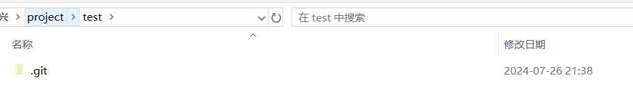

## Git 常用手册

## Git 工作区、暂存区、版本库

- **工作区：**就是你在电脑里能看到的目录。
- **暂存区：**英文叫stage, 或index。一般存放在"git目录"下的index文件（.git/index）中，所以我们把暂存区有时也叫作索引（index）。
- **版本库：**工作区有一个隐藏目录.git，这个不算工作区，而是Git的版本库。

## 从github(现有仓库)克隆项目到本地

使用`git clone [url]`命令

```shell
git clone https://github.com/duxingx/All-in-One-for-Statistical-Programming.git
```

执行该命令后，会在当前目录下创建一个名为grit的目录，其中包含一个 .git 的目录，用于保存下载下来的所有版本记录。

如果要自己定义要新建的项目目录名称，可以在上面的命令末尾指定新的名字：

```shell
git clone https://github.com/duxingx/All-in-One-for-Statistical-Programming.git mygrit
```

## Git基本操作

### 获取与创建项目命令

#### git init

用 git init 在目录中创建新的 Git 仓库。 你可以在任何时候、任何目录中这么做，完全是本地化的。

在目录中执行 git init，就可以创建一个 Git 仓库了。

```shell
mkdir test
cd test
git init
```



#### git clone

#### git add

#### git status

#### git diff

#### git commit

#### git reset HEAD

#### git rm

#### git mv

## Git分支管理
使用分支意味着你可以从开发主线上分离开来，然后在不影响主线的同时继续工作。
- 创建分支命令：

```shell
git branch (branchname)
```

- 切换分支命令：

```shell
git checkout (branchname)
```

当你切换分支的时候，Git 会用该分支的最后提交的快照替换你的工作目录的内容， 所以多个分支不需要多个目录。

- 合并分支命令:

```shell
git merge
```

你可以多次合并到统一分支， 也可以选择在合并之后直接删除被并入的分支。

### 列出分支

列出分支基本命令：

```shell
git branch
```
没有参数时，git branch 会列出你在本地的分支。

```shell
$ git branch
* master
```

当你执行 git init 的时候，缺省情况下 Git 就会为你创建"master"分支。

### 删除分支

删除分支命令：

```shell
git branch -d (branchname)
```

### 分支合并

一旦某分支有了独立内容，你终究会希望将它合并回到你的主分支。 你可以使用以下命令将任何分支合并到当前分支中去：

```shell
git merge
```

```shell
$ git branch
* master
  newtest
$ ls
README       test.txt    test2.txt
$ git merge newtest
Updating 2e082b7..556f0a0
Fast-forward
 test2.txt | 1 -
 1 file changed, 1 deletion(-)
 delete mode 100644 test2.txt
$ ls
README      test.txt
```

以上实例中我们将 newtest 分支合并到主分支去，test2.txt 文件被删除。

### 合并冲突

合并并不仅仅是简单的文件添加、移除的操作，Git 也会合并修改。

## Git查看提交历史

在使用 Git 提交了若干更新之后，又或者克隆了某个项目，想回顾下提交历史，我们可以使用 `git log` 命令查看。

## Git远程仓库

通过 Git 分享你的代码或者与其他开发人员合作。 就需要将数据放到一台其他开发人员能够连接的服务器上。例如 Github 作为远程仓库。

### 添加远程仓库

要添加一个新的远程仓库，可以指定一个简单的名字，以便将来引用,命令格式如下：`git remote add [shortname] [url]`

```shell
$ git remote add origin https://github.com/duxingx/SAS-Working-Skills.git
```

### SSH访问GitHub

由于本地Git仓库和GitHub仓库之间的传输是通过ssh加密的，所以我们需要配置验证信息：

使用以下命令生成SSH Key：

```shell
$ ssh-keygen -t rsa -C "youremail@example.com"
```

后面的your_email@youremail.com改为你在github上注册的邮箱，之后会要求确认路径和输入密码，我们这使用默认的一路回车就行。成功的话会在~/下生成.ssh文件夹，进去，打开id_rsa.pub，复制里面的key。

回到github上，进入 Account Settings（账户配置），左边选择SSH Keys，Add SSH Key,title随便填，粘贴在你电脑上生成的key。

为了验证是否成功，输入以下命令：

```shell
$ ssh -T git@github.com
Hi duxingx! You've successfully authenticated, but GitHub does not provide shell access.
```

ssh 访问 gitHub 出错如下：

```shell
$ ssh -T git@github.com
The authenticity of host 'github.com (140.82.118.4)' can't be established.
RSA key fingerprint is SHA256:nThbg6kXUpJWGl7E1IGOCspRomTxdCARLviKw6E5SY8.
Are you sure you want to continue connecting (yes/no)? 
Host key verification failed.
```

解决办法：（将GitHub添加到信任主机列表后，可以成功访问）

```shell
$ ssh-keyscan -t rsa github.com >> ~/.ssh/known_hosts
# github.com:22 SSH-2.0-babeld-d45c1532

$ ssh -T git@github.com
Warning: Permanently added the RSA host key for IP address '140.82.118.4' to the list of known hosts.
Hi earthnorth! You've successfully authenticated, but GitHub does not provide shell access.
```

### 查看当前远程仓库

要查看当前配置有哪些远程仓库，可以用命令：`git remote`

```shell
$ git remote
origin

$ git remote -v
origin  https://github.com/duxingx/SAS-Working-Skills.git (fetch)
origin  https://github.com/duxingx/SAS-Working-Skills.git (push)
```

执行时加上 -v 参数，你还可以看到每个别名的实际链接地址。


### 提取远程仓库

Git 有两个命令用来提取远程仓库的更新。

1. 从远程仓库下载新分支与数据：`git fetch`。该命令执行完后需要执行` git merge` 远程分支到你所在的分支。

    ```
    git fetch origin master
    ```

    它的意思是从名为 **origin** 的远程上拉取名为 **master** 的分支到本地分支 **origin/master** 中。既然是拉取代码，当然需要同时指定远程名与分支名，所以分开写。

2. 从远端仓库提取数据并尝试合并到当前分支：`git merge`。该命令就是在执行 git fetch 之后紧接着执行 git merge 远程分支到你所在的任意分支。

    ```
    git merge origin/master 
    ```

    它的意思是合并名为 **origin/master** 的分支到当前所在分支。既然是分支的合并，当然就与远程名没有直接的关系，所以没有出现远程名。需要指定的是被合并的分支。

### 推送到远程仓库

推送你的新分支与数据到某个远端仓库命令: `git push [alias] [branch]`。这个命令将 [branch] 分支推送成为 [alias] 远程仓库上的 [branch] 分支，实例如下。

```shell
$ touch runoob-test.txt      # 添加文件
$ git add runoob-test.txt 
$ git commit -m "添加到远程"
master 69e702d] 添加到远程
 1 file changed, 0 insertions(+), 0 deletions(-)
 create mode 100644 runoob-test.txt

$ git push origin master    # 推送到 Github
```

### 删除远程仓库

删除远程仓库你可以使用命令：`git remote rm [别名]`。

```shell
$ git remote -v
origin    git@github.com:tianqixin/runoob-git-test.git (fetch)
origin    git@github.com:tianqixin/runoob-git-test.git (push)

# 添加仓库 origin2
$ git remote add origin2 git@github.com:tianqixin/runoob-git-test.git

$ git remote -v
origin    git@github.com:tianqixin/runoob-git-test.git (fetch)
origin    git@github.com:tianqixin/runoob-git-test.git (push)
origin2    git@github.com:tianqixin/runoob-git-test.git (fetch)
origin2    git@github.com:tianqixin/runoob-git-test.git (push)

# 删除仓库 origin2
$ git remote rm origin2
$ git remote -v
origin    git@github.com:tianqixin/runoob-git-test.git (fetch)
origin    git@github.com:tianqixin/runoob-git-test.git (push)

```

## Git常用命令速查

```
master: 默认开发分支
origin：默认远程版本库
Head：默认开发分支
Head^：Head的父提交
```

```shell
#创建版本库
git clone <url> 
git init

#修改和提交
git status
git diff
git add .
git add <file>
git mv <old> <new>
git rm <file>
git rm --cached <file>
git commit -m "commit message"
git commit --amend

#查看提交历史
git log
git log -p <file>
git blame <file>

# 撤销
git reset --hard HEAD
git checkout HEAD <file>
git revert <commit>

#分支与标签
git branch
git checkout <branck/tag>
git branch <new-branch>
git branch -d <branch>
git tag
git tag <tagname>
git tag -d <tagname>

#合并与衍合
git merge <branch>
git rebase <branch>

#远程操作
git remote -v
git remote show <remote>
git remote add <remote> <url>
git fetch <remote>
git pull <remote> <branch>
git push <remote> <branch>
git push <remote>:<branch/tagname>
git push --tags
```

